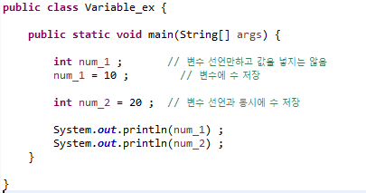
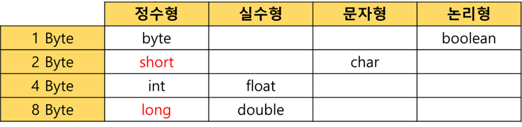
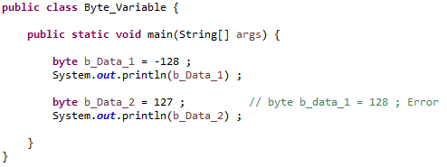
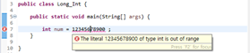

---

* 프로그래밍에서 값을 사용하기 위해 선언하는 것을 변수(변하는 수)라 함.

* 프로그램에서 사용되는 자료를 저장하기 위한 공간

* 할당 받은 메모리의 주소 대신 부르는 이름

    ​	: `age = 10` 이라 저장했을 때, `age`는 실제로 `10`이라는 값이 저장되는 메모리 상의 주소가 아님

    

* 프로그램 실행 중에 값 변경 가능

* 사용되기 이전에 선언되어야 함

    

    

    >**변수 선언 시 유의사항**
    >
    >1. 변수의 이름은 `알파벳`,  `_`,  `$`로 구성.
    >
    >2. 대소문자를 구분.
    >
    >    : 보통 시작은 소문자, 단어가 바뀔 때 대문자. `예) numberOfStudent`
    >
    >3. 변수 이름은 숫자로 시작 X, 키워드(예약어 등)도 변수 이름 사용 불가.
    >
    >4. 공백 불가.
    >
    >5. **변수의 이름은 변수의 역할과 의미를 고려하려 지정하여야 함. **

## 자료형

---

* 변수가 저장되는 공간의 특성.
* 사용할 공간의 크기와 특성에 따라 자료형을 선택.

### **정수 자료형**

* byte   :  - 27 ~  27 -1        # 8 x 1 =   8 비트     ~  맨 앞은 부호 비트(MSB)이므로 하나를 뺀다.

    ​          :  동영상, 음악파일 등 실행 파일의 자료를 처리할 때 사용하기 좋음

    

* short  :  - 215 ~  215 -1     # 8 x 2 = 16 비트

    ​          :  주로 `c` / `c++`와의 호환 시 사용.

* int      :  - 231 ~  231 -1     # 8 x 4 = 32 비트

    ​          :  자바에서 사용하는 정수 자료의 기본형. (4 바이트 단위)

    ​          :  프로그램에서 사용하는 모든 숫자는 기본적으로 int로 저장됨.

    ​					~  `Constant` / `Literal`개념

    ​		  :  32 비트를 초과하는 숫자는 long형으로 처리해야 함.

* long   :  - 263 ~  263 -1     # 8 x 8 = 64 비트

    

    ​		  :  가장 큰 정수 자료형.

    ​		  :  숫자 뒤에 `L` 또는 `l`을 써서 long형임을 표시해야 함. (`long num = 12345678900L`)

    ​		  : 자료형과 관계없이 기본적으로 4byte (int)로 메모리 저장 

    ​		  : 

    