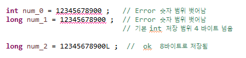
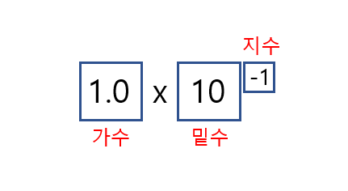
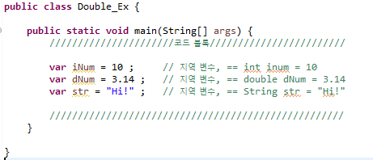

## 변수

---

* 프로그래밍에서 값을 사용하기 위해 선언하는 것을 변수(변하는 수)라 함.

* 프로그램에서 사용되는 자료를 저장하기 위한 공간

* 할당 받은 메모리의 주소 대신 부르는 이름

    ​	: `age = 10` 이라 저장했을 때, `age`는 실제로 `10`이라는 값이 저장되는 메모리 상의 주소가 아님

    

* 프로그램 실행 중에 값 변경 가능

* 사용되기 이전에 선언되어야 함

    

    

    >**변수 선언 시 유의사항**
    >
    >1. 변수의 이름은 `알파벳`,  `_`,  `$`로 구성.
    >
    >2. 대소문자를 구분.
    >
    >    : 보통 시작은 소문자, 단어가 바뀔 때 대문자. `예) numberOfStudent`
    >
    >3. 변수 이름은 숫자로 시작 X, 키워드(예약어 등)도 변수 이름 사용 불가.
    >
    >4. 공백 불가.
    >
    >5. **변수의 이름은 변수의 역할과 의미를 고려하려 지정하여야 함. **

## 자료형

---

* 변수가 저장되는 공간의 특성.
* 사용할 공간의 크기와 특성에 따라 자료형을 선택.

### **정수 자료형**

* **byte**   :  - 27 ~  27 -1        # 8 x 1 =   8 비트     ~  맨 앞은 부호 비트(MSB)이므로 하나를 뺀다.

    ​          :  동영상, 음악파일 등 실행 파일의 자료를 처리할 때 사용하기 좋음

    

* **short**  :  - 215 ~  215 -1     # 8 x 2 = 16 비트

    ​          :  주로 `c` / `c++`와의 호환 시 사용.

* **int**      :  - 231 ~  231 -1     # 8 x 4 = 32 비트

    ​          :  자바에서 사용하는 정수 자료의 기본형. (4 바이트 단위)

    ​          :  프로그램에서 사용하는 모든 숫자(Literal)는 기본적으로 int로 저장됨.

    ​					~  `Constant` / `Literal`개념

    ​		  :  32 비트를 초과하는 숫자는 long형으로 처리해야 함.

* **long**   :  - 263 ~  263 -1     # 8 x 8 = 64 비트

    

    ​		  :  가장 큰 정수 자료형.

    ​		  :  자료형과 관계없이 기본적으로 4 byte (int)로 메모리 저장.

    ​		  :  따라서 컴파일러에게 8 byte로 저장할 것을 알려주어야 함.

    ​		  :  숫자 뒤에 식별자 `L` 또는 `l`을 써서 long형임을 표시함. (`long num = 12345678900L`)

    ​								  	

### 문자 자료형

* 컴퓨터 내부에서 문자는 비트의 조합으로 표현함.

* Java에서는 문자를 2 byte ( 16 bit )로 처리.

* 인코딩 : 각 문자에 따른 특정한 숫자 값 ( 코드 값 )을 부여.

* 디코딩 : 숫자 값을 원래의 문자로 변환.

    >**문자 세트**
    >
    >: 문자에 대칭되는 특정한 숫자 값 ( 코드 값) 들을 규정해 놓은 세트.
    >
    > 1. **아스키** (ASCII)         : `1 바이트`로 영문자, 숫자, 특수문자 등을 표현. 
    >
    > 2. **유니코드** (Unicode)  :  한글 등 복잡한 언어를 표현하기 위한 세트.
    >
    >    ​								 :  기본적으로 아스키 코드를 포함
    >
    >    ​							     :  `UTF-8` , `UTF-16` 이 대표적으로 사용됨

* Java는 유니코드 UTF-16 인코딩을 사용.

### 실수 자료형

* 부동 소수점 방식 : 실수를 지수부와 가수부로 표현. 무한의 실수를 표현하기 위함.

    ​				         		

* **float** (4 byte)      :  부호비트(1 bit) + 지수부(8 bit) + 가수부(23 bit)
* **double** (8 byte)  :  부호비트(1 bit) + 지수부(11 bit) + 가수부(52 bit)
* 실수는 기본적으로 double형으로 처리.
* float형을 사용하는 경우, 식별자 `F` 또는 `f`를 붙여야 함.

### 논리 자료형

* 논리값 True, False를 표현하는 자료형.
* boolean으로 선언

## 지역 변수 자료형 추론

---

	>**자료형이 필요한 이유**
	>
	>: 변수를 선언 할 떄, 사용할 메모리 크기와 타입을 구분하기 위하여 필요.

* **지역 변수 자료형 추론** ( Local Variable Type Inference ) 

    ​	       		

    ​		: 변수에 대입되는 값을 통하여 컴파일러가 추론.

    ​		: `var`로 지정.

    ​		: 블럭 내부의 **지역 변수**만 가능.

    

