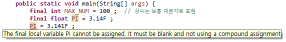
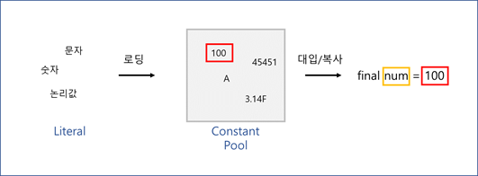

## 상수 (Constant)

---

* 상수 : 변하지 않는 값. 변수와 상대적 개념으로, 항상 일정한 값을 취함.  `ex) 원주율 = 3.14`

* 상수를 활용함으로써 코드의 관리가 용이해짐. `ex) 여러 부분을 수정할 필요 없음`

* `final`키워드로 상수임을 선언할 수 있음.

    

* 상수 값을 다른 값으로 변경하면 오류 발생.
* 상수는 보통 대문자로 정의함.

## 리터럴 (Literal)

---

* 프로그램에서 사용하는 모든 숫자, 문자, 논리값.   `ex) True, False, 100, 3.1, A, b `

* 리터럴에 해당되는 값은 특정 메모리 공간인 **상수 풀**에 있고, 요청받은 경우 가져옴.

    

    >**상수 풀 (Constant Pool)**
    >
    >: 상수를 저장하는 공간. (이외에 필드나 메소드 등 Reference 값들도 저장)
    >
    >: 실행 중 중복되는 정보가 필요할 때, 상수 풀에 있는 기존의 정보를 우선적으로 사용.

    

* 상수 풀에 저장 시, 기본적으로 `정수 : int` / `실수 : double`로 저장. 자료형에 따라 식별자 `L` ,`F` 등을 붙이는 이유. 

## 형 변환 (Type Conversion)

---

* 자료형에 따라 사용하는 메모리 크기나 방식이 각각 다름.

* 특정 자료형에 다른 자료형의 값을 넣는 경우, 형 변환이 발생.

     >**형 변환 종류**
     >
     >1. 묵시적 형 변환 (Implicit Type Conversion) : 모호한 값에서 정밀한 값으로 / 더 큰 바이트로 수정. 자동으로 변환됨.
     >
     >    ​	`ex) long num = 3 ; 별도의 식별자 없이 long 형으로 바꾸어줌`
     >
     >2. 명시적 형 변환 (Explicit Type Conversion) : 묵시적 형 변환의 반대. 정보의 **손실**이 발생할 수 있음. 때문에 프로그래머가 자료형을 명시를 해주어야함. 
     >
     >    ​	`ex) 3.1 => 3` 

