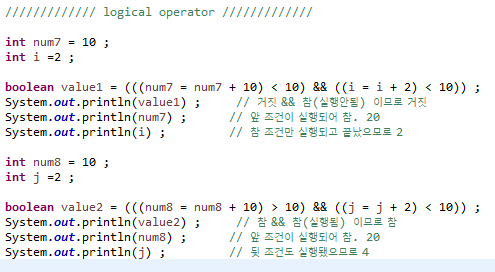

## 항과 연산자

---

* 항 (Operand) : 연산에 사용되는 값.

* 연산자 (Operator) : 항 사이의 연산 기호.

    >**항의 수에 따른 연산자**
    > 1. 단항 연산자 : 항이 한 개인 연산자. `ex) ++num`
    > 2. 이항 연산자 : 항이 두 개인 연산자. `ex) num1 + num2`
    > 3. 삼항 연산자 : 항이 세 개인 연산자. `ex) (5 > 3) ? 1: 0`
    
    
    

### 대입 연산자  (Assignment Operator)

| 연산자 |             내용             |        예        |
| :----: | :--------------------------: | :--------------: |
|  `=`   | 왼쪽 변수에 오른쪽 값을 대입 | `int age = 24 ;` |

* 변수에 값을 대입하는 연산자.
* 연산의 결과를 변수에 대입.
* 우선 순위가 **가장 낮은** 연산자.

### 부호 연산자 (Signed Operator)

| 연산자 |              내용               |  예  |
| :----: | :-----------------------------: | :--: |
|  `+`   | 변수 또는 상수 값을 양수로 변환 | `+3` |
|  `-`   | 변수 또는 상수 값을 양수로 변환 | `-3` |

* 단항 연산자.
* `양수` / `음수`의 표현. 값의 부호 변경.
* 변수에 사용하되, **대입연산자**를 통하여 값을 저장해야함.

### 산술 연산자 (Arithmetic Operator)

| 연산자 |  내용  |   예    |
| :----: | :----: | :-----: |
|  `+`   | 더하기 | `5 + 3` |
|  `-`   |  빼기  | `5 - 3` |
|  `*`   | 곱하기 | `5 * 3` |
|  `/`   | 나누기 | `5 / 3` |
|  `%`   | 나머지 | `5 % 3` |

* 그러하다.

### 증가 / 감소 연산자 (Increment / Decrement Operator)

| 연산자 |      내용      |                              예                              |
| :----: | :------------: | :----------------------------------------------------------: |
|  `++`  | 항 값에 1 더함 | `val = ++num : num에 1 더한 후 대입` `val = num++ : num값에 대입 후, 1 더함` |
|  `--`  | 항 값에서 1 뺌 | `val = --num : num에 1 뺀 후 대입` `val = num-- : num값에 대입 후, 1 뺌` |

* 단항 연산자.
* 1만큼 더하거나 뺄 때 사용.
* 항의 앞/뒤 위치에 따라 연산의 결과가 달라짐.

### 관계 연산자 (Relational Operator)

| 연산자 |                내용                |     예     |
| :----: | :--------------------------------: | :--------: |
|  `>`   |    **크다**. 참 또는 거짓 반환     | `num > 3`  |
|  `<`   |    **작다**. 참 또는 거짓 반환     | `num < 3`  |
|  `>=`  | **크거나 같다**. 참 또는 거짓 반환 | `num >= 3` |
|  `<=`  | **작거나 같다**. 참 또는 거짓 반환 | `num <= 3` |
|  `==`  |    **같다**. 참 또는 거짓 반환     | `num == 3` |
|  `!=`  |   **다르다**. 참 또는 거짓 반환    | `num != 3` |

* 이항 연산자
* 연산의 결과가 `True` 또는 `False`로 반한.

### 논리 연산자 (Logical Operator)

| 연산자 |                   내용                    |                 예                 |
| :----: | :---------------------------------------: | :--------------------------------: |
|  `&&`  | **논리 곱**. 두 항이 모두 참인 경우 == 참 | `boolean value = (5>3) && (5>2) ;` |
|  `||`  | **논리 합**. or. 둘 중 하나라도  참 == 참 | `boolean value = (5>3) || (5<2) ;` |
|  `!`   |        not. 참 -> 거짓, 거짓 ->참         |     `boolean value = !(5>3) ;`     |

* **`!`은 단항 연산자**.

* **단락 회로 평가** (SCE. Short Circuit Evaluation)

    1. 논리 곱 (&&) : 두 항이 모두 `True`일 때, 결과가 `True`. 

        ​					 : 둘 중 하나라도 `False`일 경우, `False`. `앞 조건이 거짓이면 뒷 조건은 실행 생략.`

    2. 논리 합 (||)    : 두 항이 모두 `False`일 떄, 결과가 `False`. 

        ​					 : 둘 중 하나라도 `True`일 경우, `True`.  `앞 조건이 참이면 뒷 조건은 실행 생략.`
        
        

