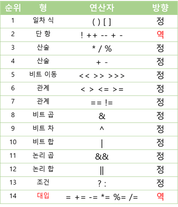

## 항과 연산자

---

### 대입 연산자 (Assignment Operator) : 복합 대입 연산자 (산술)

| 연산자 |                  내용                  |     예     |
| :----: | :------------------------------------: | :--------: |
|  `+=`  |  두 항의 값을 더한다 + 왼쪽 항에 대입  | `num += 2` |
|  `-=`  |   두 항의 값을 뺀다 + 왼쪽 항에 대입   | `num -= 2` |
|  `*=`  |  두 항의 값을 곱한다 + 왼쪽 항에 대입  | `num *= 2` |
|  `/=`  |  두 항의 값을 나눈다 + 왼쪽 항에 대입  | `num /= 2` |
|  `%=`  | 두 항 나누기의 나머지 + 왼쪽 항에 대입 | `num %= 2` |

* 대입 연산자의 일종으로 다른 연산자를 함께 사용.
* 프로그램에서 자주 사용.

### 조건 연산자 (Conditional Operator)

| 연산자                           | 내용                                       | 예                            |
| -------------------------------- | ------------------------------------------ | ----------------------------- |
| `조건식 ? 결과(참) : 결과(거짓)` | 조건식이 참이면 결과1, 거짓이면 결과2 선택 | `int num = (5 > 3) ? 10 : 20` |

* 삼항 연산자.
* 조건식의 결과에 따라 다른 결과를 산출함.
* 제어문 중 간단한 조건문을 표현하고자 할 때 가끔 사용.

### 비트 연산자 (Bitwise Operator)

| 연산자 |          내용          |                              예                              |
| :----: | :--------------------: | :----------------------------------------------------------: |
|  `~`   | 비트의 반전 (1의 보수) |                           `a = ~a`                           |
|  `&`   |     비트 단위 and      |    `1 & 1`. 두 비트 비교, 모두 1일 경우 1 반환. 그외는 0     |
|  `|`   |      비트 단위 or      |    `1 | 1`. 두 비트 비교, 하나라도 1이면 1 반환. 그외는 0    |
|  `^`   |     비트 단위 xor      |        `5 ^ 3`. 두 비트 비교, 서로 같으면 0. 그외는 1        |
|  `<<`  |       왼쪽 shift       |   `a << 3`. a를 3비트 만큼 왼쪽으로 이동 (빈 부분 0 채움)    |
|  `>>`  |      오른쪽 shift      | `a >> 3`.  a 3비트 오른쪽 이동 (빈 부분 **부호비트**와 동일) |
| `>>>`  |      오른쪽 shift      |     `a <<< 3`. a 3비트 오른쪽 이동 (빈 부분 **0** 채움)      |

* 비트 연산자는 정수에만 사용할 수 있음.

* 기본적 int 이므로 32비트로 변환 후 연산.

    >**비트 논리 연산 예**
    >
    >

* 비트 이동(shift) 연산자는 정수 데이터의 비트를 왼쪽 또는 오른쪽으로 이동시키는 연산자.

  >**쉬프트 연산자 예**
  >
  >

* 쉬프트 연산자의 경우, 결국 본래 값을 2n 만큼 곱하거나 나눈 값과 동일함.

## 연산자 우선순위

---

* 다음과 같다.

    

