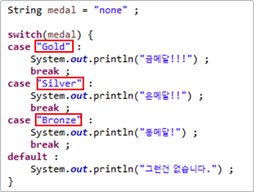
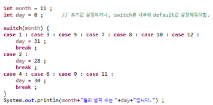

## 조건문

---

* 주어진 조건에 따라 각각의 수행문이 실행되도록 프로그래밍하는 것.

    >* 조건식 종류
    >
    >    : 조건식 내부가 참일 경우, 수행문을 실행.
    >
    >    1. if문         :  `if(조건식) { 수행문 ; }`
    >    2. if-else문  :  `if(조건식) { 수행문 ; } else { 수행문 ; }`
    >    3. else-if문  :   `if(조건식1) { 수행문 ; } else if(조건식2) { 수행문 ; } else...` (if-else 중첩문)

* 간단한 if-else 조건문은 조건 연산자를 활용할 수 있음. ` ex) result = (a > b) ? 30 : 10 ;`

## Switch-Case문

---

* 조건식의 결과가 `정수` 또는 `문자열`이고, 그 값에 따라 수행문이 결정될 때 사용할 수 있음.
* 적절한 `break` 활용 필요.
* 자바 7부터 switch-case문의 case값에 문자열 사용가능

* 각 case를 중첩해서 정의할 수 있음.

    

    ​	

