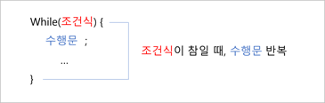
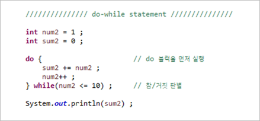
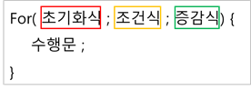
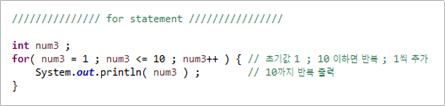
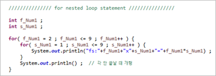
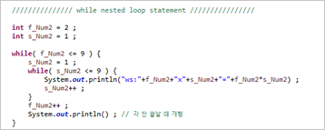

## 반복문

---

* 주어진 조건을 충족할 때까지 수행문을 반복하는 문장.
* while, do-while, for 문이 있음.
* 각 조건과 반복 여부에 대해 숙고하는 코딩을 필요로 함.

## while 문

---

* 하나의 조건에 대하여, 반복수행이 이루어질 때 사용.

* **보통** 조건이 `True`/`False`로 나타나는 편.

* `while` 뒤의 조건식이 거짓이 될 때까지 수행문을 반복함. ( = 참일 때 반복)

* 진입 시, 조건식이 참인지 거짓인지 판단함. 거짓일 경우 해당 문장을 건너뜀.

* `while(true)`의 경우 항상 참이기 때문에 무한 루프를 돎.

    

## do-while 문

---

* `while`문과는 다르게 조건식의 참/거짓 판별을 뒷 부분에서 수행함.

* `do` 블럭의 코드를 최소한 한 번은 실행하게 됨.

    

## for 문

---

* 반복문 중 가장 많이 사용.

* 주로 특정 횟수(지정된 횟수)만큼 반복할 경우 사용.

* 초기화식, 조건식, 증감식 등을 한꺼번에 작성.

    

    >1. `num3 = 1` : 초기화값 지정 (최초 1회 수행)
    >2. `num3 <= 10` : 조건식. 참일 경우 반복.
    >3. **`System.out.println( num3 )`** : **수행문** 수행. 증감식과 순서 주의!
    >4. **`num3++`** : **증감식**. 수행문 수행 이후, 수행. 이후 **2.조건식**으로 

    

* 추가적인 초기화식이나 조건식, 증감식이 있는 경우, `;` 내부에서 `,`를 통하여 추가할 수 있음 `ex) for( num3 = 1, sum = 0 ; num3 <= 10 ; num3++ )`

* 조건식을 제외한 나머지 (초기화값, 증감식)은 외부로 빼낼 수 있음. ( = for() 내부에서 생략가능 )

* `for( ; ; )` = `for( true )`

## 중첩 반복문 (Nested Loop)

---

* `while`문의 경우, 조금 더 복잡해지므로 실수하기 쉬움.

## continue, break 문

---

* **`continue`** : 반복문과 쓰이며, 이후 반복 부분을 생략하고 다음 단계(조건식 또는 증감식 등)로 넘어 가게함.
* **`break`** : 반복문과 쓰이며, `break`가 위치한 해당 반복문 블럭을 빠져나옴.

