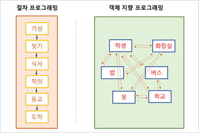
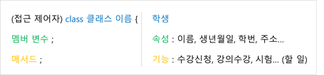

## 객체 지향 프로그램 (Object Oriented Programming)

---

* 객체 (Object) : 구체적, 추상적 데이터의 단위. 의사나 행위가 미치는 대상.

* 객체 지향 프로그래밍 (OOP, Object Oriented Programming) : 객체를 기반으로 하는 프로그래밍.

    ​	`cf) 절차 프로그래밍 (Procedural Programming) : c언어 등`

    

* 객체 지향 프로그래밍에서는 각 객체들의 **협력**을 통하여 프로그램을 완성함.
    * 객체를 정의. 
    * 객체 기능을 구현.
    * 객체 사이의 **협력** 구현.
    
    

>**인스턴스 (Instance)**
>
>: 클래스에 의하여 만들어진 객체로, 대상 클래스와의 관계성을 표현할 때 사용함.  
>
>​	`ex)과일 클래스의 인스턴스인 복숭아(객체)`
>
>: Java에서는 `new`를 통하여 클래스의 인스턴스를 생성함. 

## 클래스 (Class)

---

* 클래스 : 객체에 대한 속성과 기능을 코드로 구현한 것. 소위 '클래스 정의'라 함.

    * 객체 **속성** : 객체의 특성, 속성 등을 **멤버 변수**로 나타냄. ( = `property`, `attribute`, `member variable`)

    * 객체 **기능** : 객체가 하는 기능들을 **메서드**로 구현. ( = `method`, `member function`)

        

### 클래스 정의하기

* 클래스는 대부분 **대문자**로 시작함.
* 하나의 Java파일에는 하나의 클래스를 두는 것이 원칙. 
* 여러 클래스가 혼재한 경우, **`public`**클래스는 **단 하나**이며, `public`클래스 이름과 Java파일 이름은 동일해야함.
* 모든 자바 코드는 클래스 내부에 위치해야함.

### 클래스 기능

* 메서드(Method)로 구현. 멤버 함수(Member Function)라고도 한다.
* 객체가 수행하는 작업을 구현

>**패키지란?**
>
>1. 소스의 묶음.
>2. 보통 속성이나 기능, 역할에 따라 분류. 따라서 계층 구조를 형성하기도 함. 
>3. 이러한 구조는 프로젝트 전체 소스코드를 구성하는 계층이 됨.
>4. 패키지를 잘 구성한다는 것은, 코드 관리와 유지보수에의 편의를 제공한다는 것과 같음.