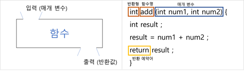
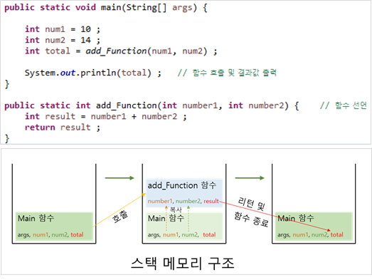

## 메서드 (Method)

---

* 함수의 일종. 

    >**함수란?**
    >
    >: 하나의 기능을 수행하는 일련의 코드.
    >
    >: 반복되는 기능을 함수로 구현 및 호출할 수 있음.
    >
    >: 자바에는 따로 함수가 존재하지 않고, 클래스 내에 메소드로 존재함.

    

* 객체의 기능을 제공하기 위하여 클래스 내부에 구현된 함수.

* 메소드 사용 시, 클래스를 **사용하는 쪽** 입장에서 함수명 선언. `ex) 변수를 가져오는 경우 => get`

    

    >**반환형**  :  반환 값의 자료형을 나타냄. 반환값이 없는 경우 `void`라 정의.
    >
    >**함수명**  :  함수 정의 및 호출 시 사용. 함수 기능과 관련하여 명명함.
    >
    >**매개 변수**  :  함수 수행을 위하여 필요한 변수.
    >
    >**반환 예약어**  :  함수의 결과를 반환할 때 필요한 예약어.

## 함수 & 스택 메모리

---

* 함수가 호출될 때 사용하는 메모리를 스택(Stack) 메모리라 함.

* 함수의 기능 수행이 끝나면 자동으로 메모리 반환

    