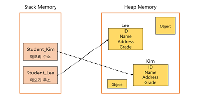
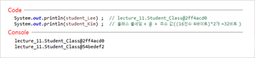
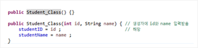
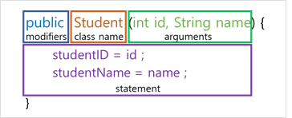

## 클래스와 인스턴스 (Class & Instance)

---

* 클래스 (Class)  :  객체에 대한 속성과 기능을 코드로 구현한 것.
* 인스턴스 (Instance)  :  클래스에 의해 만들어진 객체. 대상과 클래스와의 관계성을 표현할 때 사용.

## 클래스 생성하기

---

* 클래스를 사용하기 위해서는 클래스 생성이 필요.

* 자바 내 `new` 예약어를 통하여 클래스 생성 가능.   `ex) 클래스형 변수명 = new 생성자 ;`

    >**변수 타입 비교하기**
    >
    >* `int i = 10 ;`
    >
    > 	  : 여기서 int는 객체가 아니라 **기본 자료형(Primitive data types)**임.
    >
    >* `Student Student_Lee = new Student()`
    >
    > 	  : 여기서 Student는 **객체**임. 반드시 생성 후에 사용할 수 있음.
    >
    >     : 이러한 객체를 **참조형 데이터 타입 (Reference data types)**이라 함.
    >	
    >     : 참조형 데이터 타입 뒤의 `Student_Lee`는 참조변수라 함.

## 인스턴스와 힙 (Heap) 메모리

---

* 하나의 클래스 코드로부터 여러개의 인스턴스가 생성됨.

* **스택** 메모리에는 **지역변수**가 위치하고, 지역변수는 힙 메모리의 각 **인스턴스 주소**를 나타냄.

* **힙** 메모리란 필요에 의해 **동적**으로 형성되는 메모리.

* 힙 메모리 내 여러 인스턴스는 각각의 **독립적**인 공간을 갖음.

    

>**힙 메모리 특징**
>	:  스택에 쌓인 메모리의 경우, 함수가 종료되면 자연스럽게 소멸함.
>	:  하지만 힙 내부의 메모리는 한 번 생성되면 자동으로 지워지지 않음.
>	:  `C 언어`에서는 직접 삭제해야했지만, `Java`에서는 `가비지 콜렉터(GC, Garbage Collector)`가 대신 수행.

## 용어 설명

---

|          용어          |                    설명                     |
| :--------------------: | :-----------------------------------------: |
|         `객체`         | 객체 지향 프로그램의 대상. 생성된 인스턴스. |
|        `클래스`        |      객체를 프로그래밍하기 위한 코드.       |
|       `인스턴스`       |       클래스가 메모리에 생성된 상태.        |
|      `멤버 변수`       |            클래스의 속성, 특성.             |
| `메서드`,  `멤버 함수` |   멤버 변수를 이용한 클래스의 기능 구현.    |
|      `참조 변수`       |  메모리에 생성된 인스턴스를 가리키는 변수.  |
|       `참조 값`        |    생성된 인스턴스의 메모리 **주소 값**     |

* 참조 값

    

## 생성자 (Constructor)

---

* 하나의 클래스에는 기본적으로 하나 이상의 생성자가 존재함.

* 클래스에 생성자가 **하나도 없는 경우**, 자바 컴파일러가 컴파일할 때 **기본 생성자**를 넣어줌.

* 생성자를 **임의로 지정**할 경우, 기본 생성자를 지원해주지 않음.

* 생성자에 매개변수를 지정할 경우,  인스턴스 생성할 때 해당 값을 입력해줘야 함.

* 동일한 이름의 함수, 생성자가 여러 개 존재할 수 있음. (생성자 오버로딩)

    >**오버로딩 (Overloading)**
    >
    >* 하나의 클래스에서 동일한 이름의 메소드 또는 생성자를 여러개 정의하는 것.
    >* 다양한 입력 값을 받기 위하여 사용.
    >
    >* 선언된 매개 변수 타입의 순서와 개수가 달라야 함.
    >
    >
    
    
    
* 생성자 기본 구조

	: 생성자는 인스턴스를 초기화할 떄의 명령어 집합.
	: 생성자의 이름은 그 클래스의 이름과 동일함.
	: 생성자는 메소드가 아니므로, 상속되지 않음.
	: 반환 값 없음.

### 기본 생성자 (Default Constructor) 

* 프로그래머가 생성자를 넣지 않으면 자바 컴파일러가 기본 생성자를 자동으로 넣어줌.

* 기본 생성자에는 매개 변수나 구현 코드가 없음.

     

