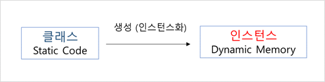

## 클래스와 인스턴스 (Class & Instance)

---

* 클래스 (Class)  :  객체에 대한 속성과 기능을 코드로 구현한 것.
* 인스턴스 (Instance)  :  클래스에 의해 만들어진 객체. 대상과 클래스와의 관계성을 표현할 때 사용.

## 클래스 생성하기

---

* 클래스를 사용하기 위해서는 클래스 생성이 필요.

* 자바 내 `new` 예약어를 통하여 클래스 생성 가능.   `ex) 클래스형 변수명 = new 생성자 ;`

    >**변수 타입 비교하기**
    >
    >* `int i = 10 ;`
    >
    > 	  : 여기서 int는 객체가 아니라 **기본 자료형(Primitive data types)**임.
    >
    >* `Student Student_Lee = new Student()`
    >
    > 	  : 여기서 Student는 **객체**임. 반드시 생성 후에 사용할 수 있음.
    >
    >     : 이러한 객체를 **참조형 데이터 타입 (Reference data types)**이라 함.
    >	
    >     : 참조형 데이터 타입 뒤의 `Student_Lee`는 참조변수라 함.

## 인스턴스와 힙 (Heap) 메모리

---

* 하나의 클래스 코드로부터 여러개의 인스턴스가 생성됨.

* **스택** 메모리에는 **지역변수**가 위치하고, 지역변수는 힙 메모리의 각 **인스턴스 주소**를 나타냄.

* **힙** 메모리란 필요에 의해 **동적**으로 형성되는 메모리.

* 힙 메모리 내 여러 인스턴스는 각각의 **독립적**인 공간을 갖음.

    

>**힙 메모리 특징**
>	:  스택에 쌓인 메모리의 경우, 함수가 종료되면 자연스럽게 소멸함.
>	:  하지만 힙 내부의 메모리는 한 번 생성되면 자동으로 지워지지 않음.
>	:  `C 언어`에서는 직접 삭제해야했지만, `Java`에서는 `가비지 콜렉터(GC, Garbage Collector)`가 대신 수행.

