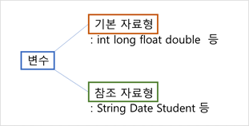
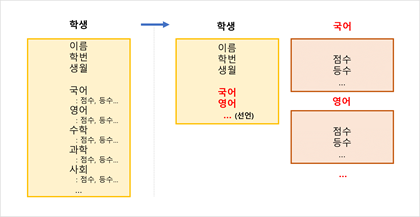

## 참조 자료형 (Reference Data Type)

---

* 변수의 자료형 종류

* 자바의 참조 자료형은 `자바 라이브러리`에서 제공하는 자료형 (String 등) 과 `클래스`로 선언하는 자료형으로 이루어짐.

* 프로젝트의 관리와 유지보수를 위해, 클래스를 적정하게 분리하고 참조하는 것이 효율적.

    

## 정보은닉 (Information Hiding)

---

* `private`란? : 접근 제어자의 한 종류.

    >**private 접근 제어자 (Private Access Modifier)**
    >
    >:  클래스의 외부에서 당해 클래스 내부의 멤버변수나 메서드에 접근 불가능하게 만듦.
    >
    >:  멤버변수나 메서드를 외부에서 사용하지 못하도록 만들어 오류를 줄임. (**데이터의 무결성**)
    >
    >​	( **데이터 무결성** : 데이터의 정확성, 일관성, 유효성이 유지되는 것을 말함. )
    >
    >:  변수에 대해, 필요한 경우 **get()**, **set()** 메서드를 제공함.

    

* 접근 제어자 종류

| 접근제어자        | 설명                                                         |
| ----------------- | ------------------------------------------------------------ |
| `public`          | **외부** 클래스에서도 접근가능.                              |
| `private`         | **자기** 클래스 내부에서만 접근가능.                         |
| `default (지정X)` | 같은 **패키지** 내부에서만 접근가능.                         |
| `protected`       | 패키지 내 또는 해당 클래스를 **상속**받은 외부 패키지 클래스에서 접근가능.  본 내용은 상속 부분에서 다룰 것. |

