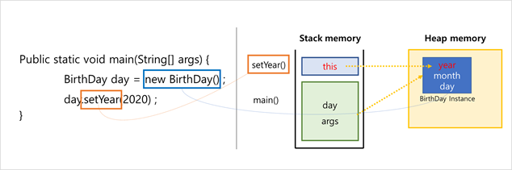
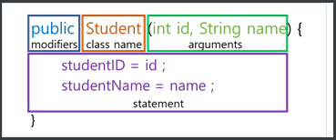
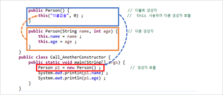
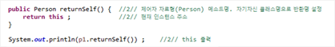

## This

---

1. 자기 자신에 생성된 인스턴스 메모리를 가리킴. (생성된 메모리의 주소)

2. 생성자에서 다른 생성자를 호출할 수 있음.

3. 자신의 주소를 반환.


### 1. 자신의 메모리를 가리킴

* 앞서 만들어진 클래스 인스턴스 자기 자신을 말하는 예약어? 아마도.
* 지역변수 이름이 필드 이름과 동일한 경우, (`this` 없이는) 같은 이름의 가장 가까운 지역변수로 인식해버림. 따라서 가려진 필드의 이름을 알려주는 용도.
* 이는 보통 변수 명을 정할 때, 해당 의도나 의미를 가장 잘 나타내는 단어로 지정하기 때문임. 




### 2. 생성자에서 다른 생성자를 호출하는 this()



* **생성자**는 인스턴스를 초기화할 떄의 명령어 집합. (이미지 참조)
* 인스턴스가 생성될 때 `new` 키워드 쓰지않는 한 생성자를 호출되지 않음.
* 그러나 객체 내에서는 `this`를 이용하면 다른 생성자 호출 가능
* 여러 생성자가 필요할 때( 생성자 오버로드 ), 코드 반복을 줄이기 위하여 사용함.



* `this`를 이용하여 다른 생성자를 호출할 때는 그 이전에 어떠한 statement 사용불가.

    	```java
    public Person() {
        int birthDate = 20200101 ;    -> X. 오류발생
    
        this("이름없음", 0) ;          // this 이전에 어떠한 statement도 사용못함.
    }
    ```

​    

### 3. 자신의 주소를 반환.

