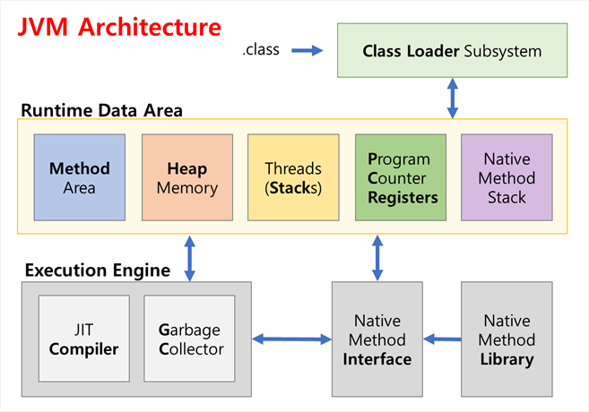
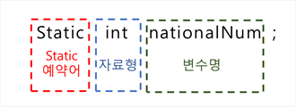
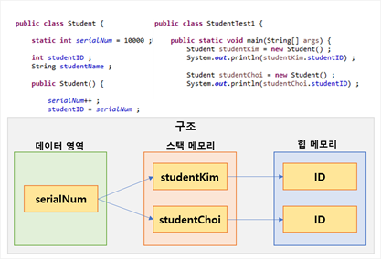

## Static 변수

### 	메모리 구조

### 정적 변수 (Static Variable) 의의

* 여러 인스턴스가 같은 메모리 값을 공유하기 위해 사용. 즉, 공용 사용 여부로 판단.
* 전체 프로그램이 메모리에 로드될 때, 메모리를 할당 받음.
* 클래스 변수라고도 함. ( 멤버 변수 == 인스턴스 변수 )
* 인스턴스가 아닌 클래스에 정의된 멤버이므로, 일단 클래스가 로드되면 접근 가능해짐.
* static 변수는 ( JVM의 Runtime Data Area 에 위치한 ) Method Area에 저장됨. ( 데이터 영역, 정적 영역 )
* GC (Garbage Collector)의 관리를 받지 않고, 프로그램이 종료될 때 메모리에서 지워짐.

#### 1.장점

> * heap 메모리는 동적 메모리로, 각 객체가 생성될 때에 메모리를 할당받고 소멸할 때 자동으로 지워짐(Free).
> * 인스턴스가 생성될 때 마다, heap 메모리 내에 객체변수 저장을 위한 공간이 할당됨. 
> * 다시 말해, 인스턴스 마다 동일 값이 반복되는 변수가 있으면 이는 메모리 사용의 효율성을 떨어뜨린다는 의미.
> * 따라서 동일 반복값을 static 변수에 할당 및 **공유**하는 것이 메모리 측면에 있어 효율성이 높음.

#### 2.단점

> * 객체 지향 관점의 프로그래밍과는 거리가 있으며, 코드의 추적 및 확장에 어려움이 있음.
> * 또한, 많은 static 변수는 오히려 메모리 회수를 불가능하게 하여 시스템 성능을 떨어뜨리는 결과를 초래할 수 있음. 

### Static 구조

​	: 변수나 메소드 앞 부분에 `static` 키워드를 붙여 사용.

### 사용 예

## Static 메소드

* 클래스 메소드라고도 함.

* 메소드에 `static` 키워드 붙여 사용.

* 보통 static 변수를 위한 기능 제공.

* static 메소드의 경우, 내부에 생성 여부가 불확실한 **멤버변수(인스턴스 변수)를 사용할 수 없음**. 

    ​	:  사용을 위해서는 인스턴스 생성이 선행되어야 하나, 일반적으로 인스턴스의 생성 시기가 더 늦기 때문. 

* 인스턴스의 생성 여부와 관계없이 사용가능. 

* 인스턴스 이름으로 호출하는 것이 아니라(사용은 가능), 클래스 이름을 직접 호출하여 사용. 

## 변수 정리

| 유형                 | 선언 위치        | 사용 범위               | 메모리      | 생성 및 소멸            |
| -------------------- | ---------------- | ----------------------- | ----------- | ----------------------- |
| 지역 변수 (로컬)     | 함수 내          | 함수 내                 | 스택        | 함수 호출 / 종료        |
| 멤버 변수 (인스턴스) | 클래스 멤버 변수 | 클래스 내외 (참조 변수) | 힙          | 인스턴스 생성 / GC 수거 |
| static 변수 (클래스) | 클래스 내        | 클래스 내외             | 데이터 영역 | 프로그램 시작 / 종료    |

