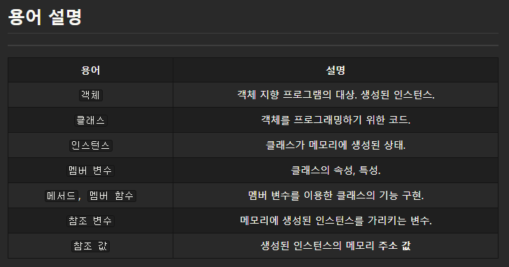
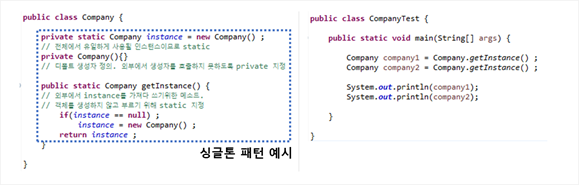

# Static 응용

>  ### 소프트웨어 디자인 패턴
>
>  : 소프트웨어 설계의 재사용을 통하여 생산성을 향상시키는 기법.
>
>  : 반복적인 문제 상황에 대한 해결 경험 및 방안에 대한 정형화 자료. 
>
>  : 간략히 말해, 객체 간의 유용한 상호작용 방법에 관한 집대성임.

* 그냥 복습

    

##  Singleton pattern

* 전 시스템에 오로지 1개의 인스턴스만 존재하도록 하는 디자인 패턴.

    ​	:  인스턴스가 늘어나면 자연스럽게 메모리 낭비나 오류를 발생할 가능성이 높아지기 때문.

    ​	:  객체 로딩 시간이 줄어들며 성능을 높일 수 있음

* 일반적으로 싱글톤 클래스의 인스턴스는 글로벌 변수이며, 이러한 특성으로 참조가 용이함.

* 생성자의 호출이 반복되어도, 실제로는 최초의 인스턴스를 불어오는 것임.

* Java에서는 `static` 키워드를 사용해 만들 수 있음. 

    

>1. 외부에서 생성자를 호출하지 못하도록 생성자를 `private` 지정. (외부에서 인스턴스 생성 불가)
>
>    * `ex. private Company(){} ;`
>2. 자신의 클래스 타입을 `static`으로 지정한 후, 인스턴스 생성 및 초기화.
>
>    * `ex. private static Company instance = new Company() ;`
>
>3. 외부에서 호출할 수 있도록 public으로 선언된 static 메소드 제공.( getInstance )
>
>    * `ex. public static Company getInstance(){ return instance } ;`
>    * 추가적으로 인스턴스가 null값이 경우를 핸들링해줄 수도 있음.
>
> :  결과적으로 `Company1`과 `Company2`는 동일한 객체임을 알 수 있음.

### 싱글톤 패턴의 문제

* 싱글톤 패턴 자체가 클래스 인스턴스 간의 관계성을 높이므로 OCP 원칙(Open-Closed Principle, 개방-폐쇄 원칙)에 어긋남.
* 객체 간 관련성이 높으므로 싱글톤 패턴의 수정 시에 문제가 발생할 확률이 높음.
* 멀티쓰레드 환경에서는 동기화처리가 필요함.

>#### 개방-폐쇄 원칙 (OCP, Open-Closed Principle)
>
>* '소프트웨어 개체(클래스, 모듈, 함수 등)는 확장에 대해 열려 있어야 하고, 수정에 대해서는 닫혀 있어야 한다'는 프로그래밍 **원칙**
>* 추후에 다룰 것임.