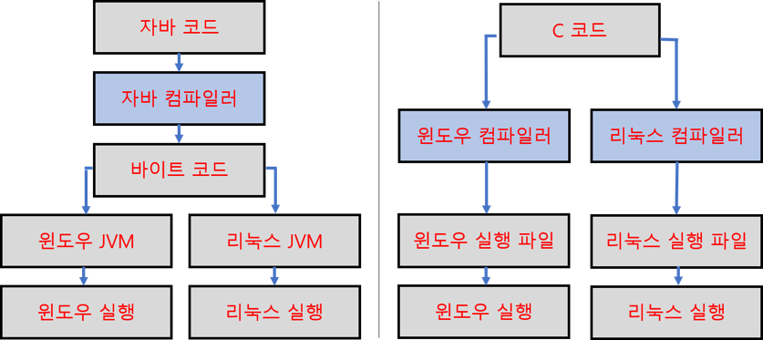

---

## 프로그래밍이란?

---

프로그래밍 : 컴퓨터가 일을 하도록 명령어를 만드는 것

컴파일 : 프로그램 언어를 컴퓨터가 알 수 있는 언어(기계어)로 변환하는 것

컴파일러 : 기계어로 변역해주는 프로그램 (Java 설치 시, 컴파일러도 같이 설치)

---

## Hello Java World!

---

1. New Project뢔 새 프로젝트 만들기

2. src(source) 우클릭 후, New 카테고리에 Package 선택

3.  `Ctrl` + `N` 누르고, class 검색 및 next

    > * `class` 이름은 항상 대문자 시작
    >
    > * `package` 이름은 항상 소문자 시작

    

4. `class` 이름 설정
5. 하단 `public static void main(String[] args)` 체크로 메인함수 넣기

6. System.out.println("Hello, Java World") ; 입력

    > * 컴파일 관련
    >
    >     : 상단바의 `Project`에 `Build Project` 버튼이 있음.
    >
    >     : `Build Automatically`에 체크 시, 프로젝트 저장할 때에 함께 컴파일됨
    >
    >     : 컴파일된 `class`파일은 프로젝트 폴더의 `bin`(binary) >> `package 이름` 폴더에 위치

7. 상단바 `Run` 누르면 하단 콘솔창에 출력.

---

## 자바의 특성

---

* **가상머신(JVM)**의 사용을 통해, 플랫폼에 영향을 받지 않으므로 다양한 환경에서 사용 가능.

* **C 언어**의 경우, OS에 종속적인 성향이 있음. 따라서 각 OS별로 따로 컴파일 필요. 대신 빠름.

* Python이나 Javascript 같은 스크립트 언어는 실행 시 오류가 발생하는 반면, 자바나 C언어는 컴파일 과정에서 오류가 발생.
* 객체 지향 언어이기 때문에 유지보수가 쉽고 확장성이 좋음.
* 프로그램이 안정적. (기존 언어의 불안정성이 Java의 등장 배경)
* 풍부한 오픈 소스 라이브러리.

