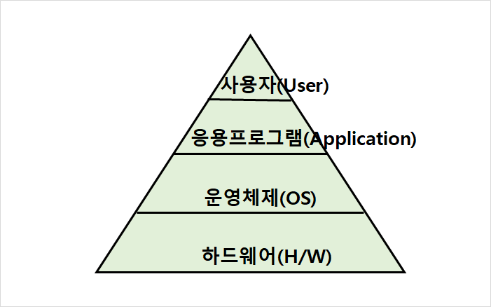
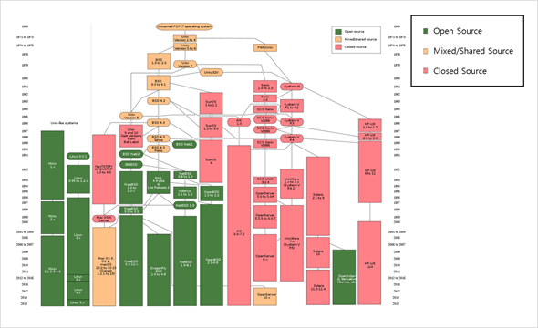
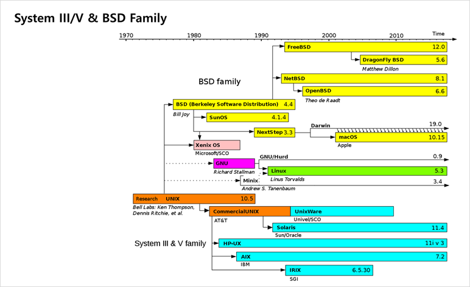
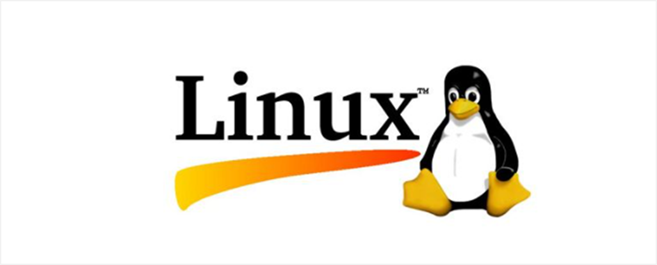
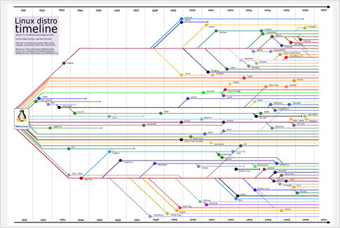
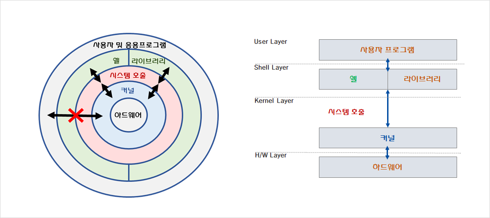
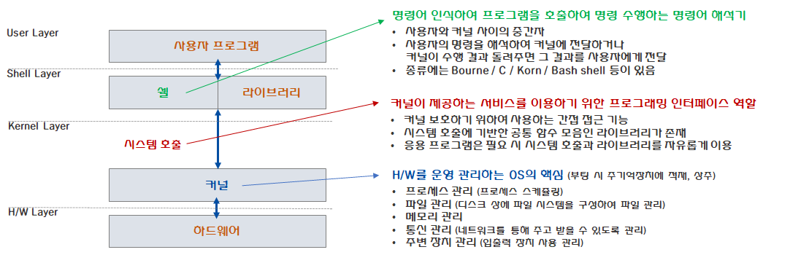

# 01. Unix & Linux 개요

## 1. 유닉스와 리눅스의 탄생

### 운영체제(OS, Operating System)

* 컴퓨터 시스템 자원들을 효율적으로 관리하고 사용자가 컴퓨터를 편리하고 효과적으로 사용할 수 있도록 환경을 제공하는 여러 프로그램들의 모임. 즉, <u>**컴퓨터 시스템을 제어하는 프로그램들의 집합**</u>. 대표적으로는 Windows, Unix, Linux, MS-Dos 등이 있다.

* 초기 운영체제는 1대의 컴퓨터 시스템에 대해 동시에 한 사용자만이 사용할 수 있도록 하는 단일 사용자 시스템 형태였으나, <u>**유닉스**를 시작으로 **다중 사용자 / 다중 작업 운영체제**</u>로 발전함.

    

    >프로그램 : 문제해결을 위한 처리 방법과 순서를 기술한 일련의 명령문 집합
    >
    >응용프로그램 : 어떠한 문제를 해결하기 위하여 사용자 또는 특정 전문가가 작성한 프로그램

    

---

### 유닉스(Unix)

[이미지 출처 : 헤시넷]

#### (1) 유닉스(Unix)  :  현대 컴퓨터 운영체제의 시초

* 1969년, 벨 연구소의 켄 톰슨(Ken Thompson)과 데니스 리치(Dennis Ritchie)가 개발.

* 초기에는 저급 언어인 어셈블리(Assembly) 언어로 작성되었으나, 고급 언어인 C언어의 등장 이후 <u>**C언어**</u>로 변경되었음. (1973년)

    ><u>고급언어 vs. 저급언어</u>
    >
    >| 구분      | 고급 언어                             | 저급 언어                         |
    >| --------- | ------------------------------------- | --------------------------------- |
    >| 중심 대상 | 사람 중심                             | 기계 중심                         |
    >| 용이성    | 쉽다                                  | 어렵다                            |
    >| 호환성    | 좋다(상이한 기계에서 코드수정 불필요) | 나쁘다(상이한 기계에서 코드 변화) |
    >| 실행속도  | 상대적으로 느리다                     | 빠르다                            |
    >
    >* 어셈블리(Assembly) : 프로그래밍 언어 중 하나로, 기계어와 함께 저급언어로 분류.

* 유닉스는 다른 컴퓨터 시스템 프로그램과 달리 일반인에게 공개함으로써 대학과 기업체을 중심으로 빠르게 전파됨.

* AT&T가 벨 연구소를 인수하게 되면서 유닉스를 상용으로 공급하게 됨.

  ​    

#### (2) 유닉스의 계보 및 계통

* 유닉스는 AT&T의 상업용 유닉스인 `System V`계열과 캘리포니아 대학의 버클리 캠퍼스에서 학문연구 목적으로 만들어진 `BSD (Berkeley Software Distribution)`계열로 나뉘어 발전함.

* 근래에는 두 가지 계열의 장점을 결합한 통합형 유닉스 운영체제로 발전 중. 

​     			

[이미지 출처 : 위키백과]

​	

>|     분류      |                   설명                   |      예      |
>| :-----------: | :--------------------------------------: | :----------: |
>| 유전적 유닉스 | 유닉스 소스코드에 기반한 유닉스 운영체제 |  macOS, iOS  |
>| 상표적 유닉스 |    단순히 유닉스의 상표 사용권만 허용    |  z/OS(IBM)   |
>| 기능적 유닉스 |  기능적으로는 유사하지만 유닉스와 무관   | Linux, Minix |

#### (3) 유닉스의 종류

AT&T의 상업용 유닉스인 <u>**System V (시스템 5) 계열**</u>과 UC 버클리에서 개발한 학문연구 목적의 <u>**BSD(Berleley Software Distribution) 계열**</u>로 나뉘어 발전함.

* System V 계열
    * AT&T 벨 연구소 개발 유닉스
    * 대부분 상용 제품
    * 종류 : AIX (IBM) / HP-UX (HP)  / Solaris (Sun/Oracle) 등

* BSD 유닉스 계열
    * UC 버클르에서 발전
    * 메모리 관련 및 네트워킹(Socket, TCP/IP 등) 관련 기능 확대
    * 종류 : Sun OS (Sun) / Free BSD / Mac OS X (Apple) / iOS (Apple)

---

### 리눅스(Linux)

[이미지 출처 : 위키백과]

* 1991년 핀란드 헬싱키 대학의 리누스 토발즈(Linus Torvalds)가 개발.

* 미닉스(Minix)를 쓰면서 개선사항을 커널에 추가하였고 새 운영체제에 가까울 정도로 기능을 보유함.
* 유닉스와 마찬가지로 다중 사용자 / 다중 작업 등을 지원하는 운영체제.
* 유닉스처럼 서버로 작동하는데 최적화.

* 현재는 데스크톱 / 랩톱 뿐 아니라 웹 서버 클라우드 안드로이드 및 포터블 게이밍, 모바일 기기, 임베디드 기기 등을 구동하는 운영체제이다. (컴퓨팅 워크로드 90% / 스마트폰 82% / 임베디드 기기 62% / 슈퍼컴퓨터 시장의 99%)

> >1. 리눅스와 유닉스는 호환가능.
> >2. 오픈 소스
> >3. 다양한 네트워킹 기술을 제공하고 있으므로 서버용 OS로 적합

### 리눅스의 종류

[이미지 출처 : https://www.reddit.com/r/linuxmasterrace/comments/7diwwi/linux_distro_timeline/]

리눅스는 오픈소스로 이루어져있기에 누구든지 수정 및 배포할 수 있으며, 크게 3가지 계열로 나눌 수 있음.

> >* 슬렉웨어(Slackware) 계열 : 현재까지 살아남은 가장 오래된 배포판이며 안정성과 단순성이 장점.
> >* 종류 : **SuSE** / Porteus / Vector Linux / Salix OS 등
> >
> >

>* 데비안(Debian) 계열 : 커뮤니티 배포판으로 업데이트가 늦고 기술지원/사후지원이 어려움.
>* 종류 : **Ubuntu** / Linux Mint / Kali Linux 등
>
>

>* 레드햇(RedHat) 계열 : 기업용 서버 분야에서 가장 널리 쓰이는 OS.
>* 종류 : **RHEL** / **CentOS** / Fedora / Oracle Linux / AWS Linux 등
>
>

> * 모바일 등에 많이 사용되는 안드로이드(Android) 역시 리눅스 계열의 OS.
>
> 

[이미지 출처 : 해시넷/나무위키]

## 02. 유닉스 리눅스의 특징

### 유닉스의 특징

><u>**단순성**</u>
>
>
>
>- 운영체제 자체를 단순화시켜 최소한의 필요 기능만 제공
>- 자원에 관한 일관성 있는 관점 제공, 주변 장치를 파일과 같은 형식으로 사용

><u>**이식성 및 확장성**</u>
>
>
>
>* 고급언어인 C로 작성되어 다양한 플랫폼에 이식하여 사용가능. 즉, 하드웨어 종류에 상관없이 운용 가능
>* 각 기능이 모둘화되어 있어 새 기능 추가시 모듈추가로 가능

><u>**개방성**</u>
>
>
>
>* 소스 코드 고개
>* 대학에서 유닉스를 기반으로 여러가지 유용한 S/W 개발 보급
>* 유닉스의 양적, 질적 면에서 폭발적 성장을 촉진한 원동력

><u>**대화형 시스템**</u>
>
>
>
>* 명령어 기반의 사용자 인터페이스 이용
>* 유닉스가 이해할 수 있는 명령을 사용자가 입력하고 유닉스는 명령처리 결과를 화면에 출력 

><u>**다중 사용자 / 다중 작업 시스템**</u>
>
>
>
>* 여러 사용자가 컴퓨터에 동시에 접속하여 사용할 수 있는 운영체제
>* 사용자들은 직렬회선으로 연결된 단말기를 통해 유닉스에 접속
>* 한 대의 컴퓨터에서 여러 작업을 동시에 수행 가능

><u>**쉘 스크립트**</u>
>
>
>
>* 운영체제 내에서 명령어나 유틸리티 등으로 프로그램을 작성할 수 있도록 하는 프로그램
>
>* 기존 프로그램을 결합하여 보다 큰 프로그램 작성

><u>**다양한 부가 기능 제공**</u>
>
>
>
>* Ftp, Telnet, www 등 다양한 네트워크 응용 프로그램 제공
>
>* 웹 서버, DB 서버, 메일 서버, 뉴스 서버, 네임 서버 등 네트워크 서버 기능 지원
>
>* 프로그래밍 및 디버깅 도구, 문서 편집 도구, 출력 관련 도구 등 사용자 편의 도구 제공

><u>**가상 메모리**</u>
>
>
>
>* 메모리를 초과할 경우, 보조기억장치(HDD/SDD 등)에 초과분을 기록 및 출력. (Swap 기능)

### 유닉스와 리눅스의 비교

* 유닉스와 리눅스

| 비교            | Unix                | Linux          |
| --------------- | ------------------- | -------------- |
| 가격            | 대부분  유료        | 대부분  무료   |
| 개발/배포  주체 | 기업,  비영리  단체 | 커뮤니티  중심 |

​	: 무엇보다도 유닉스와 리눅스의 가장 큰 차이는 커널의 차이라 볼 수 있음.

​	: 유닉스의 경우 상업용이므로 사용권 등에 의해 일반 사용자의 접근이 어려웠고, 

​	  리눅스는 이 커널 새롭게 만들어 배포한 것. (리눅스란 엄밀히 말하자면 리눅스의 커널을 의미)

* 유닉스와 윈도우

| 비교   | Unix                       | Windows                      |
| ------ | -------------------------- | ---------------------------- |
| 신뢰도 | 높음                       | 낮음                         |
| 성능   | 대규모  네트워크 부하 적합 | 대규모  네트워크 부하 부적합 |
| 지원   | 상대적으로  좋음           | 느리고  부족                 |
| 편의성 | 명령어  기반 인터페이스    | 그래픽  기반으로 접근성 높음 |

## 03. 유닉스 시스템의 구조

* 구성요소 : 하드웨어, 커널, 쉘 및 라이브러리, 사용자, 응용 프로그램

* **커널(Kernel)** :  HW를 운영 관리하는 OS의 핵심.

    * 프로세스 관리 (프로세스 스케쥴링)
    * 파일 / 메모리 / 통신 / 입출력장치 관리

    

* **시스템 호출(System Call)** : 커널이 제공하는 서비스를 이용하기 위한 프로그래밍 인터페이스

    * 커널을 보호하기 위하여 만들어짐. (사용자는 직접적으로 커널에 접근할 수 없음)
    * 시스템 호출에 기반한 공통함수 모음이 라이브러리가 존재하며, 응용프로그램은 이를 필요시 자유룝게 사용.

    

* **쉘(Shell)** : 명령어 인식 및 프로그램을 호출하여 사용자의 명령을 수행.

    * 사용자와 커널 사이에 위치하는 중간자.
    * 사용자의 명령을 해석하여 커널에 전달 / 수행결과를 사용자에게 반환.
    * 종류에는 Bourne / C / Korn / Bash shell 등등이 있다.

    

## 04. 유닉스 리눅스의 활용분야

* 서버

    : 웹 서버, DB 서버, 파일 서버, 메일 서버, 뉴스 서버, 네임 서버, 클러스터링 등

* 임베디드 시스템

    :  통신 단말기 : 휴대폰, PDA, PMP, 무선 IP 공유기, IPTV 셋탑박스, 인터넷폰 등

    :  네트워크 장비 : 스위치, 방화벽, 게이트웨이 등

    :  가전 제품 : TV, 냉장고, DVD Player, MP3 Player 등

    :  생산 설비 : 홈오토메이션, 공장 자동화, 산업용 로봇 등

