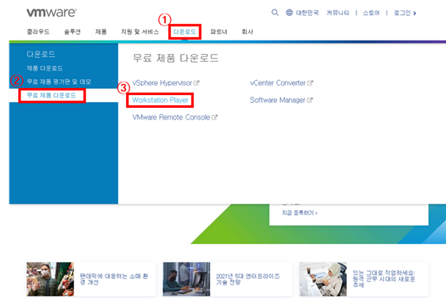
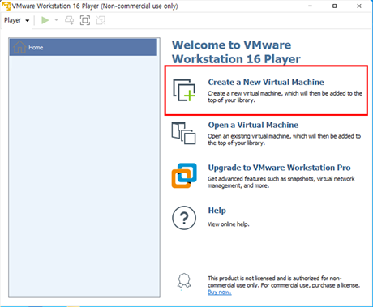

# 02. 가상머신을 활용한 리눅스 설치

## 1. 가상머신(Virtual Machine, VM)

* 물리적 컴퓨터가 아닌, 다른 컴퓨터가 만들어내는 가상의 컴퓨터. 즉 컴퓨터 안에 있는 컴퓨터. (출처:나무위키)
* 컴퓨터 자원 중 일부를 가상머신에 할당하고 이를 이용하는 방식.
* 가상 머신에는 크게 `프로세스 가상 머신`과 `시스템 가상 머신` 등이 있음. 
* 본 정리에서의 가상 머신이란, 운영체제 설치를 위한 `시스템 가상 머신`을 의미.
* 일반적인 원도우 환경에서도 이 가상머신을 활용하여 쉽게 다른 운영체제를 사용할 수 있음.
* 대중적으로 사용되는 가상머신 프로그램은 **`VMware`**, **`VirtualBox`**.

## 2. 가상머신 프로그램 설치 (VMware Workstation)

: 개인적으로 VirtualBox 보다는 <u>VMware가 설치가 쉽고 사용이 가볍다는 느낌을 받았음</u>. 고로 VMware를 사용.

1. VMware 사이트로 이동. [[링크]](https://www.vmware.com/kr.html)

2. 다운로드 탭으로 이동.

3. 무료 버전인 Workstation Player와 유료 버전인 Warkstation Pro 중 선택하여 다운로드.

      Workstation Player는 무료 제품 다운로드 항목에 있음.

    

4. 설치

## 3. 가상머신에 OS 설치 (Linux - Ubuntu)

: 여기서는 리눅스 데비안 계열의 우분투를 설치할 것임.

1. VMware 실행.

    

2. Create a New Virtual Machine 클릭하여 가상 머신을 생성.

    

    

3. 

