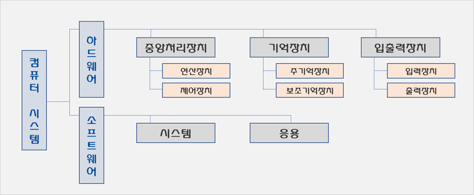
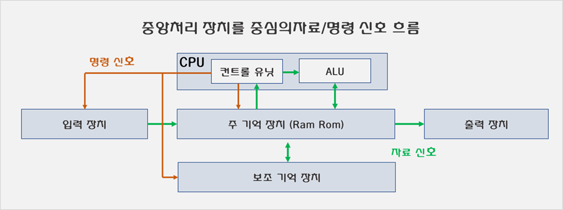
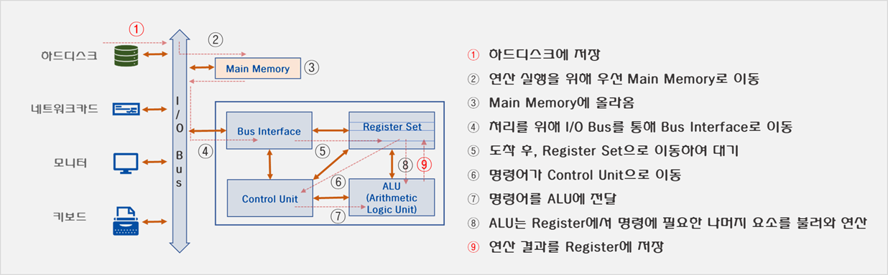
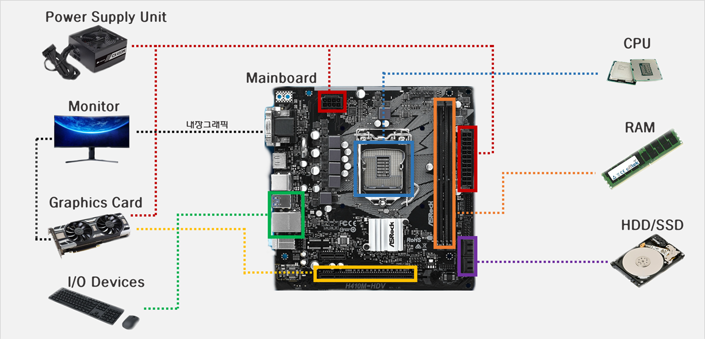

# 02. 컴퓨터의 구조

## 01. 컴퓨터 시스템

* 컴퓨터 시스템은 하드웨어와 소프트웨어를 포괄하는 큰 개념.

* 하드웨어란 전자회로와 그 밖의 물리적 장치를 의미.

* 소프트웨어란 하드웨어 활용 기술 및 프로그램을 의미.

    

    ><u>**컴퓨터 시스템 개괄**</u>
    >
    >
    >
    >

## 02. 하드웨어

* 컴퓨터 시스템의 하드웨어는 크게 입출력장치 / 중앙처리장치 / 기억장치로 나눌 수 있음. 

    * 입출력장치(ID/OD, Input/Output Device) 

        * `입력장치` : 문자나 기호 등의 데이터를 컴퓨터가 이해할 수 있도록 2진수 형태의 전기적 신호로 변환하는 장치. 
        * `출력장치` : 컴퓨터에서 처리한 결과를 사람이 인식할 수 있도록 변환시켜주는 장치.

    * 중앙처리장치(CPU, Central Processing Unit)

        * 명령을 수행하고 데이터를 처리하는 장치로, 컴퓨터 시스템의 핵심.
        * 내부적으로는 `연산장치(산술논리장치)`/`제어장치`/`레지스터`/`버스인터페이스`로 구성.

    * 기억장치(Memory)

        * 주기억장치(Main/System/Primary Memory) : 명령 처리를 위해 해당 명령이나 사용할 데이터 등을 기억하는 장치 [Ram(Random Access Memory), Rom(Read Only Memory)으로 구성]. 
        * 보조기억장치(Secondary Memory / Storage) : 주기억 장치의 보조 역할.

        

>###  중앙처리장치의 구조
>
>
>
>* 중앙처리장치는 내부적으로 산술논리(연산) / 제어 / 레지스터 / 버스 인터페이스 장치 로 구성.
>    * 산술논리장치(ALU, Arithmetic Logic Unit) : 실질적으로 산술 연산과 논리 연산을 수행하는 디지털 회로.
>    * 제어장치(CU, Control Unit) : 프로세서의 조작을 통괄 지시하는 부분. 입출력 장치 간 통신 및 조율 제어하며 데이터 처리를 위한 결정을 수행.
>    * 레지스터(Process Register) : 중앙연산장치 내에 위치한 고속 메모리. 프로세서가 바로 사용할 수 있도록 소량의 데이터나 처리 중인 중간 값 등을 대기시키는 영역. (구성 : MBR / MAR / IR / PC)
>    * 버스 인터페이스 장치(Bus Interface Unit) : 전기적 신호를 통신규약에 적합하게 주고 받을 수 있도록  해주는 장치. 
>
>
>
>

## 03. 컴퓨터 장치의 구조

### 전체 구조

: 일반적으로 언급되는 컴퓨터 장치는 크게 다음의 요소로 구성됨.

* CPU(Central Processing Unit) : 명령을 수행하고 데이터를 처리하는 컴퓨터 핵심 장치. 제조사에 따라 Intel / AMD 계열로 분류.
* 메인보드(MainBoard / MotherBoard) : 각 부분을 연결하고 전원 분배와 장치 통합 관리를 수행하는 부분. 
* 램(RAM, Random Access Memory) : 주기억 장치 중 하나. 크게 SRAM과 DRAM 계열로 구분. 
* HDD(Hard Disk Drive) / SSD(Solid State Drive) : 보조기억장치.
* 그래픽카드(Graphics Card, VGA) : 그래픽 작업을 전문적으로 처리하고 디지털 신호를 영상 신호로 변환 전송하는 장치. 대표적으로 Nvidia와 AMD 계열로 나눌 수 있음. 
* 파워서플라이(Power Supply Unit) : 전원공급장치.
* 마우스/키보드/모니터 등의 입출력 장치

[이미지 출처 : Amazon / 다나와]

><u>**SRAM vs. DRAM**</u>
>
>
>
>* SRAM(Static RAM) : 
>
>    * 전원이 공급되는 한 기억이 유지. 
>    * 속도는 빠르지만 복잡하고 비싸며 집적도를 높이기 어렵기 때문에 보통 캐시 메모리에 사용.
>
>* DRAM(Dynamic RAM) : 
>
>    * 일반적으로 사용되는 RAM을 의미. 
>    * 전원이 공급되어도 주기적으로 방전되기 때문에 충전이 필요. 
>    * 상대적으로 느리지만 집적도를 높이기 비교적 쉬움.
>
>    
>
>현재 보편적으로 사용되는 Ram은 DDR SDRAM(Double Data Rate Synchronous DRAM)임.
>
>

### 메인보드 세부

