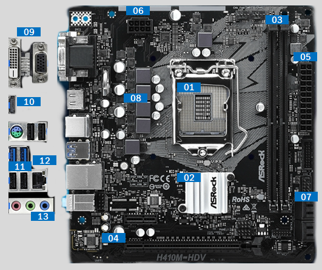

# 02. 컴퓨터의 구조

## 01. 컴퓨터 시스템

* 컴퓨터 시스템은 하드웨어와 소프트웨어를 포괄하는 큰 개념.

* 하드웨어란 전자회로와 그 밖의 물리적 장치를 의미.

* 소프트웨어란 하드웨어 활용 기술 및 프로그램을 의미.

    

    ><u>**컴퓨터 시스템 개괄**</u>
    >
    >
    >
    >

## 02. 하드웨어

* 컴퓨터 시스템의 하드웨어는 크게 입출력장치 / 중앙처리장치 / 기억장치로 나눌 수 있음. 

    * 입출력장치(ID/OD, Input/Output Device) 

        * `입력장치` : 문자나 기호 등의 데이터를 컴퓨터가 이해할 수 있도록 2진수 형태의 전기적 신호로 변환하는 장치. 
        * `출력장치` : 컴퓨터에서 처리한 결과를 사람이 인식할 수 있도록 변환시켜주는 장치.

    * 중앙처리장치(CPU, Central Processing Unit)

        * 명령을 수행하고 데이터를 처리하는 장치로, 컴퓨터 시스템의 핵심.
        * 내부적으로는 `연산장치(산술논리장치)`/`제어장치`/`레지스터`/`버스인터페이스`로 구성.

    * 기억장치(Memory)

        * 주기억장치(Main/System/Primary Memory) : 명령 처리를 위해 해당 명령이나 사용할 데이터 등을 기억하는 장치 [Ram(Random Access Memory), Rom(Read Only Memory)으로 구성]. 
        * 보조기억장치(Secondary Memory / Storage) : 주기억 장치의 보조 역할.

        

>###  중앙처리장치의 구조
>
>
>
>* 중앙처리장치는 내부적으로 산술논리(연산) / 제어 / 레지스터 / 버스 인터페이스 장치로 구성.
>    * 산술논리장치(ALU, Arithmetic Logic Unit) : 실질적으로 산술 연산과 논리 연산을 수행하는 디지털 회로.
>    * 제어장치(CU, Control Unit) : 프로세서의 조작을 통괄 지시하는 부분. 입출력 장치 간 통신 및 조율 제어하며 데이터 처리를 위한 결정을 수행.
>    * 레지스터(Process Register) : 중앙연산장치 내에 위치한 고속 메모리. 프로세서가 바로 사용할 수 있도록 소량의 데이터나 처리 중인 중간 값 등을 대기시키는 영역. (구성 : MBR / MAR / IR / PC)
>    * 버스 인터페이스 장치(Bus Interface Unit) : 전기적 신호를 통신규약에 적합하게 주고 받을 수 있도록  해주는 장치. 
>
>
>
>

## 03. 컴퓨터 장치의 구조

### 전체 구조

: 일반적으로 언급되는 컴퓨터 장치는 크게 다음의 요소로 구성됨.

* CPU(Central Processing Unit) : 명령을 수행하고 데이터를 처리하는 컴퓨터 핵심 장치. 제조사에 따라 Intel / AMD 계열로 분류.
* 메인보드(MainBoard / MotherBoard) : 각 부분을 연결하고 전원 분배와 장치 통합 관리를 수행하는 부분. 
* 램(RAM, Random Access Memory) : 주기억 장치 중 하나. 크게 SRAM과 DRAM 계열로 구분. 
* HDD(Hard Disk Drive) / SSD(Solid State Drive) : 보조기억장치.
* 그래픽카드(Graphics Card, VGA*) : 그래픽 작업을 전문적으로 처리하고 디지털 신호를 영상 신호로 변환 전송하는 장치. 대표적으로 Nvidia와 AMD 계열로 나눌 수 있음. 
* 파워서플라이(Power Supply Unit) : 전원공급장치.
* 마우스/키보드/모니터 등의 입출력 장치.

VGA : 본래 IBM이 개발한 그래픽카드의 표준(640x480)을 지칭하는 말이었지만, 현재는 그래픽카드와 동일한 의미로 사용.

 

[이미지 출처 : Amazon / 다나와]

><u>**SRAM vs. DRAM**</u>
>
>
>
>* SRAM(Static RAM) : 
>
>    * 전원이 공급되는 한 기억이 유지. 
>    * 속도는 빠르지만 복잡하고 비싸며 집적도를 높이기 어렵기 때문에 보통 캐시 메모리에 사용.
>
>* DRAM(Dynamic RAM) : 
>
>    * 일반적으로 사용되는 RAM을 의미. 
>    * 전원이 공급되어도 주기적으로 방전되기 때문에 충전이 필요. 
>    * 상대적으로 느리지만 집적도를 높이기 비교적 쉬움.
>
>    
>
>현재 보편적으로 사용되는 Ram은 DDR SDRAM(Double Data Rate Synchronous DRAM)임.
>
>

### 메인보드 세부

[이미지 출처 : 다나와]

| 번호 | 명칭                | 설명                                                         |
| :--: | ------------------- | ------------------------------------------------------------ |
|  01  | CPU 소켓            | CPU 장착 부분. 소켓 종류 마다 설치할 수 있는 CPU가 달라짐.   |
|  02  | 메인보드 칩셋       | 메인보드 연결 장치 통합 제어 및 관리 부분.                   |
|  03  | 메모리 슬롯         | 주기억장치인 RAM을 장착 부분.                                |
|  04  | PCI-E 3.0 x16 슬롯* | PCI(Peripheral Component Interconnect Bus) E(Express)는 주변기기 연결을 위한 버스 규격. I/O 장치와 그래픽카드, 보조기억장치 연결 가능. |
|  05  | 메인보드 주전원     | 24핀의 표준 주전원 케이블을 연결할 수 있는 부분.             |
|  06  | 메인보드 보조전원   |                                                              |
|  07  | SATA 커넥터*        | HDD, SSD 등 보조기억장치 연결부.                             |
|  08  | 전원부              | 전력을 각 연결 장치에에 안정적으로분배 및 전달해주는 부분.   |
|  09  | DVI-D / D-sub       | 디지털 / 아날로그 영상신호를 전달하는 단자.                  |
|  10  | HDMI 포트           | 영상/음성신호를 압축하지 않고 전송하는 디지털 신호 단자. 고품질의 영상/음성을 전송. |
|  11  | USB 포트            | 범용 직렬 버스(Universal Serial Bus)는 다양한 입출력단자를 통합하여 보다 쉽게 장치를 이용하기 위하여 만들어짐. |
|  12  | LAN 포트            | 일반적인 가정 또는 회사의 네트워크를 근거리 통신망(LAN, Local Area Network)이라 하고 이를 사용하기 위한 단자. |
|  13  | 오디오 포트         | 분홍색 : 마이크 / 연두색 : 스피커 / 하늘색 : 외부 오디오기기 |

* PCI-E 3.0버전의 경우, 각 레인(lane=bit)은 984.6 MB/s의 전송 속도를 가짐. 즉 x16의 경우 984.6 x 16으로 약 15.7GB/s의 전송 속도를 가짐.

* SATA(Serial Advanced Technology Attachment): 보조기억장치 연결을 위한 기존의 IDE(integrated Drive Electronics)를 대체하기 위한 컴퓨터 버스의 일종.
* DP(Display Port) : PC용 영상 인터페이스를 대체할 목적으로 만들어졌으며, 현존하는 모든 대역폭의 주사율과 해상도 출력이 가능한 고속 단자.

### 보조기억장치

현재 일반적으로 사용되는 보조기억장치는 크게 HDD와 SSD임.

* HDD(Hard Disk Drive)
    * 비휘발성, 순차접근이 가능한 컴퓨터 보조기억장치.
    * 비휘발성 데이터 저장소 중 용량 대비 가격이 저렴하기 때문에 많이 사용.
    * 고속으로 디스크를 회전시키며 저장하는 방식으로 인하여 소음이 발생.
    * 여러장의 자기 디스크가 쌓여있는 구조로 충격에 취약.

* SSD(Solid State Drive)
    * `Solid-state`는 고체 상태의 소체(트랜지스터). 즉, 반도체 소자로 만들어진 보조기억장치를 의미.
    * HDD가 자기 디스크를 사용하는데 반하여, SDD는 플래시 메모리로 구성.
    * 기존 HDD 구동 방식(모터/헤드 이동)이 물리적 한계를 극복하기 위하여 만들어짐.
    * 속도, 수명, 크기, 무게 및 안정성 면에서 HDD보다 월등하나, 비싸다는 단점이 있음.
    * 규격으로는 SATA / mSATA(노트북) / M.2(mSATA 대체) / PCI-E (x4) 등이 있음.

