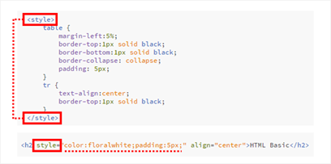

# CSS 기본

## Style

* **style** 는 HTML에서 CSS의 적용을 나타내는 키워드.

* 웹 브라우저는 style 키워드를 읽고, 뒤따라오는 문법(속성)을 CSS에 따라 해석하여 결과를 출력함.

* 일반적으로 해당 CSS 문법을 적용할 대상인 **선택자(Selector)**의 지정이 필요함.

* 적용 방식으로는 크게 **인라인**, **내부** 시트, **외부** 시트가 있음. 

    * 인라인 스타일 (Inline Style) : 해당 요소 내부에 직접 속성 지정.
    * 내부 스타일 시트 (Internal Style Sheet) : `<head>` 태그 내부에서 속성 지정.
    * 외부 스타일 시트 (External Style Sheet) : `<head>` 내부에 `<link>`를 통하여 css 확장자를 불러옴.
    
    >CSS 적용 우선순위
    >
    >1. 인라인 스타일 (무조건)
    >2. 내부 / 외부 스타일 시트 (두 시트 경합 시, 최후 적용) 
    
* ㄹ

