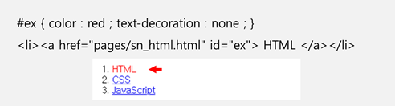
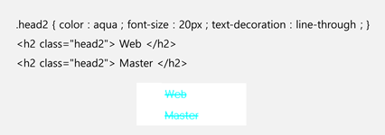
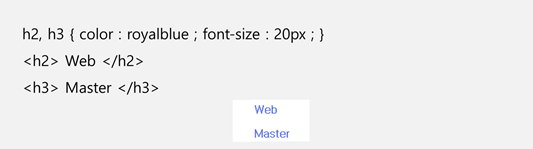
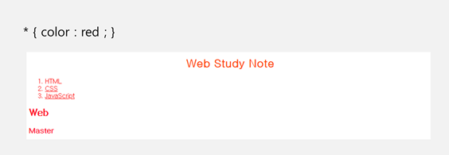

# CSS 적용

## CSS 기본구조

* **선택자** (Selector) : 스타일 적용 대상 지정.
* **선언부** (Declaratives) : 해당 선택자의 모든 스타일 속성과 값이 정의되는 부분이며 중괄호로 구분.
* **선언** (Declaration) : 개별 속성.
  * **속성** (Property) : 적용할 스타일 속성의 이름.

      >동일한 카테고리의 속성은 모아서 정의 가능 
      >
      > ex) { border-width : 5px ; border-style: solid ; border-color : red ; } == { border : 5px solid red ; }

  * **속성값** (Value) : 스타일 속성의 구체적 수준 또는 옵션.

  * **구분자** (Delimiter) : 해당 속성의 정의가 끝났음을 나타내는 문자. 

## CSS 적용기준

* 상하 수준에서는 보다 구체적이며 지협한 개념의 우선 순위가 높음. ( id > class > HTML element )  
* 동일 수준에서는 최후 적용의 원칙이 적용됨. (가장 나중에 적용된 개념이 더 우선. 덮어쓰기.)

## CSS 선택자

* 선택자는 요소 / 아이디 / 클래스 / 그룹 / 보편(Universal)으로 지정할 수 있음.

    ### 1.선택자 : 요소

    

    * HTML 내 요소를 직접 선택하여 스타일을 지정할 수 있음.

        

    ### 2.선택자 : 아이디

    

    * 가장 우선순위가 높은 계층의 선택자.
    * `#`을 지정하여 id임을 명기해야함.
    * id의 경우, 페이지 내에서 id당 하나의 요소만 매칭하여 사용할 것이 권고됨. (복수 매칭 가능)
    * 단, 중복 매칭 사용 시, 자바스크립트에서는 오류발생.

    

    ### 3.선택자 : 클래스

    

    * 2순위 선택자.
    * 같은 클래스 집단의 스타일을 정의함.  
    * 클래스임을 나타내는 `.`을 명기하여야 함.

    

    ### 4.선택자 : 그룹

    

    * 그룹 선택자는 선택자에 명시한 모든 HTML 요소의 스타일을 지정할 수 있음.
    * 구룹 선택자의 적절한 사용은 코드의 양을 최소화할 수 있음.
    * 각 선택자 사이는 쉼표(`,`)로 구분됨.

    

    ### 5.선택자 : 보편 (Universal)

    

    * 웹페이지 내, 모든 HTML 요소를 선택.
    * 선택자 위치에 `*`을 사용함으로써 지정 가능.

    

