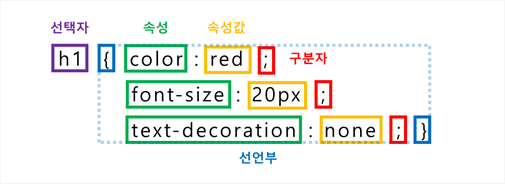
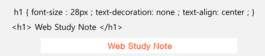

# CSS 적용

## CSS 기본구조

* **선택자** (Selector) : 스타일 적용 대상 지정.
* **선언부** (Declaratives) : 해당 선택자의 모든 스타일 속성과 값이 정의되는 부분이며 중괄호로 구분.
* **선언** (Declaration) : 개별 속성.
	* **속성** (Property) : 적용할 스타일 속성의 이름.
	* **속성값** (Value) : 스타일 속성의 구체적 수준 또는 옵션.
	* **구분자** (Delimiter) : 해당 속성의 정의가 끝났음을 나타내는 문자. 

## CSS 적용기준

* 상하 수준에서는 보다 구체적이며 지협한 개념의 우선 순위가 높음. ( id > class > HTML element )  
* 동일 수준에서는 최후 적용의 원칙이 적용됨. (가장 나중에 적용된 개념이 더 우선. 덮어쓰기.)

## CSS 선택자

* 선택자는 요소 / 아이디 / 클래스 / 그룹으로 지정할 수 있음.

    ### 1.선택자 : 요소

    

    * HTML 내 요소를 직접 선택하여 스타일을 지정할 수 있음.

        

    ### 2.선택자 : 아이디

    

    * 가장 우선순위가 높은 계층의 선택자.
    * id의 경우, 페이지 내에서  사용할 것이 권고됨. ()

