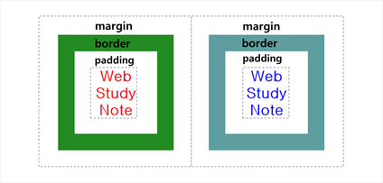
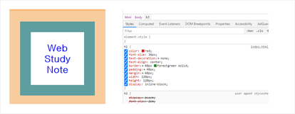

# CSS 디자인

## 박스모델 (CSS Box Model)

### 1. 공간 개념

* HTML 요소들은 각 용도에 따라 사용공간이 미리 설정됨. ( 기본 값은 CSS로 재정의 할 수 있음. )
    * Block Level Element : 페이지 공간 전체를 사용. (허용된 범위 내)
    * Inline Element : 선택된 요소 공간만 사용.
* 간단하게 display 속성으로 지정 가능.

### 2.박스 모델

* HTML 구성에 대한 기본 공간 개념.
* 박스 모델은 크게 4계층으로 나누어져 있음.
    * 컨텐트 (Content, 1계층) : 실질적 내용이 오는 부분. **가시** 영역.
    * 패딩 (Padding, 2계층) : 컨텐트 바깥 부분. 불가시 영역.
    * 보더 (Border, 3계층) : 패팅 외곽의 경계**선**. **가시** 영역.
    * 마진 (Margin, 4계층) : 최외곽의 공간. 다른 요소들과의 경계. 불가시 영역.

* 박스모델의 크기는 `width`와 `height`로 세부적으로 조정 가능함.

* 웹브라우저 도구인 `검사`항목을 통해 해당 태그에 영향을 주는 요소를 찾을 수 있음. (우클릭 > 검사 > 스타일)

