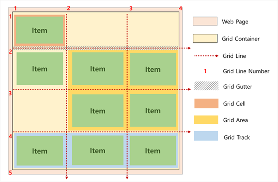

# 배치

## 그리드 시스템 (Grid System)

>#### 	참조 : Flex box (Flexible Box)
>
>* CSS3에서 처음 선보인 레이아웃 모델.
>
>* 상황마다 HTML 요소가 자동 재정렬되게 하여 다양한 형태의 화면에서도 웹 페이지의 항시성을 보장됨.
>
>    
>
>* Flex Box는 컨테이너(Container)와 내부dml 아이템(item)들로 구성됨.
>
>* 등장 배경
>
>    * 기본적으로 웹 사이트의 레이아웃은 `수직 방향`(위->아래)임.
>
>    * 쉽게 구성가능한 `수직 방향` 레이아웃과는 달리, `수평 방향`(왼쪽->오른쪽) 레이아웃은 구성하기 어려움.
>
>        : HTML 요소들(Elements)이 보통 블록 개념을 사용하기 때문.
>
>    * inline-block, float, tabel 과 같은 대안책은 있었지만, 자유로운 활용이 쉽지 않았음.
>
>    * 이러한 `수평 방향`의 문제해결을 위해 flex가 고안됨.

### 그리드 시스템 의의

* 웹 페이지의 배열을 정의하는 레이아웃 모델의 하나.
* `Flex Box`가 수평 레이아웃을 정의하는 1차원 시스템인 것과 달리, Grid System은 수직-수평의 2차원 시스템임.
* 수직-수평의 2차원 레이아웃을 정의함으로써, 기존 웹 페이지보다 복잡하고 세밀한 구성이 가능하게 되었음.

### 그리드 구성

|               명칭               | 설명                                                         |
| :------------------------------: | ------------------------------------------------------------ |
| 그리드 컨테이너 (Grid Container) | :  모든 아이템의 부모 요소.                                  |
|    그리드 아이템 (Grid Item)     | :  배치된 컨테이너의 자식 요소.                              |
|     그리드 라인 (Grid Line)      | :  그리드의 행과 열을 구분하는 선으로 각각 라인 번호를 가지고 있음. |
|    그리드 거터 (Grid Gutter)     | :  아이템 사이의 행/열 갭을 의미.                            |
|      그리드 셀 (Grid Cell)       | :  그리드 라인으로 둘러쌓인 최소 그리드 단위.                |
|   그리드 에어리어 (Grid Area)    | :  그리드 라인으로 둘러쌓인 영역으로 셀들의 집합.            |
|     그리드 트랙 (Grid Track)     | :  수평 또는 수직 그리드 라인 사이의 연속된 공간.            |

### 그리드 시스템 실습

>#### 	참조
>
>`
 
` : 단순히 디자인 용도로 사용. 블럭 레벨 엘리먼트.
>
>` ` : 같은 용도. 인라인 엘리먼트.

1. 그리드 전체를 감싸는 부모 지정.

2. 배치하고자하는 자식 그리드 지정.

3. 영역 설정 후, 해당 영역에 `display:grid;` 입력하여 그리드로 만듦.

4. 이후 `grid-template`항목을 적절히 배치해 넣으면 됨.

    ​	ex) `grid-template-columns:150px 1fr(남은 공간 전체);`  ~ 150픽셀 영역 + 남은(-150px) 전체 영역
    ​	: `fr`이란 화면에서 차지하는 비율값을 나타내는 단위. 

    ​	: 총 fr값에서 해당 fr이 차지하는 비율. `1fr 3fr`의 경우 총 fr값은 4이며, 따라서 `1fr`은 25%.

    

## 유용한 사이트

* [`can i use`](https://caniuse.com/) : html, css 등의 기술에 대한 통계와 사용 가능 환경 알림.

