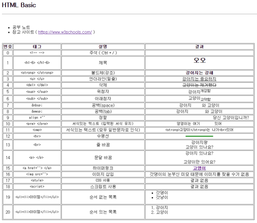

## HTML 기본태그

* [참고 사이트 w3schools ]( https://www.w3schools.com/ )
* 정리

## 자주 쓰는 태그

| 번호 | 태그                                             | 설명                                   | 결과                                                     |
| ---- | ------------------------------------------------ | -------------------------------------- | -------------------------------------------------------- |
| 0    | &lt;!-- --&gt;                                   | 주석 ( Ctrl + / )                      |                                                          |
| 1    | &lt;h1~6&gt; &lt;/h1~6&gt;                       | 제목                                   | 오오                                                     |
| 2    | &lt;strong&gt; &lt;/strong&gt;                   | 볼드체(강조)                           | **강아지는 강해**                                        |
| 3    | &lt;u&gt; &lt;/u&gt;                             | 언더라인(밑줄)                         | <u>강아지는 중요하지</u>                                 |
| 4    | &lt;del&gt; &lt;/del&gt;                         | 삭제                                   | ~~고양이는 제거했다~~                                    |
| 5    | &lt;sup&gt; &lt;/sup&gt;                         | 위첨자                                 | 강아지개강함                                  |
| 6    | &lt;sub&gt; &lt;/sub&gt;                         | 아래첨자                               | 고양이고약함                                  |
| 7    | &amp;nbsp;                                       | 공백(space)                            | 강아지   와 고양이                                       |
| 8    | &amp;emsp;                                       | 공백(tab)                              | 강아지    와 고양이                                      |
| 9    | align =""                                        | 정렬                                   | 당신 고양이입니까?                                       |
| 10   | &lt;pre&gt; &lt;/pre&gt;                         | 서식있는 텍스트 (입력된 서식 유지)     | 댕댕이는 여기        있어                                |
| 11   | &lt;xmp&gt;                                      | 서식있는 텍스트 (모두 일반문자로 인식) | &lt;strong&gt;고양이&lt;/strong&gt;는 나가&lt;br&gt;있어 |
| 12   | &lt;hr&gt;                                       | 수평선                                 |                                                          |
| 13   | &lt;br&gt;                                       | 줄 바꿈                                | 강아지랑 고양이 있나요?                               |
| 14   | &lt;p&gt; &lt;/p&gt;                             | 문달 바꿈                              |                                                          |
| 15   | &lt;a href=""&gt; &lt;/a&gt;                     | 하이퍼링크                             | [**고앵이**](https://namu.wiki/w/고양이)                 |
| 16   | &lt;img src=""&gt;                               | 이미지 삽입                            | 갓댕이의 눈부신 미모 때문에 이미지를 찾을 수가 없음      |
| 17   | &lt;style&gt;                                    | CSS 사용                               |                                                          |
| 18   | &lt;script&gt;                                   | 스크립트 사용                          |                                                          |
| 19   | &lt;ul&gt;&lt;li&gt;아이템&lt;/li&gt;&lt;/ul&gt; | 순서 없는 목록                         |                                                          |
| 20   | &lt;ul&gt;&lt;li&gt;아이템&lt;/li&gt;&lt;/ul&gt; | 순서 있는 목록                         |                                                          |

