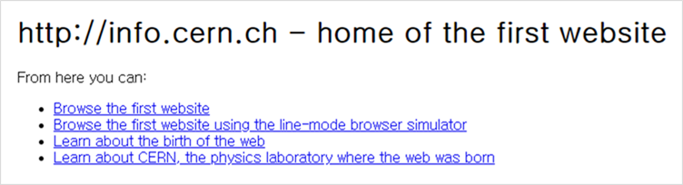
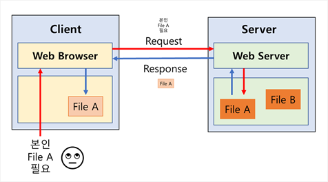

## Web

### Web과 Internet

* **World Wide Web** (`WWW`, `W3`)을 간단히 줄여 **웹**이라 함.
* 인터넷에 연결된 사용자들이 서로의 정보를 **공유**할 수 있는 공간.
* 웹(Web)은 인터넷의 여러 서비스 중 하나. ( internet ⊃ FTP, email, web.... ) 
* 시대 상황으로 인하여, 기존 중앙 집중적 통신 시스템이 분산형 시스템으로 이행되었음. 이것이 **인터넷**(1960).
* CERN 소속의 팀 버너스 리가 1989년 전세계의 망을 하나로 묶은 인트라넷을 제안.  ( 참조 : Enquire )
* 1990년 10월 최초의 웹 편집기 제작, 11월에는 최초의 웹 브라우저인 World Wide Web을 만듦.

* 1990년 12월, 웹 서버라는 프로그램을 만들고, 해당 컴퓨터에 `info.cern.ch`라는 주소를 부여함.

## 서버와 클라이언트

* [참조](https://github.com/16Hongc/TIL/blob/master/Web/%EC%9B%B9%20%EA%B8%B0%EC%B4%88(Web).md "웹 기초")

* 웹 구동의 주 요소 : 웹브라우저(Web Browser, WB), 웹서버(Web Server, WS)

* 웹 브라우저는 **클라이언트 (Client)**, 웹 서버는 **서버(Server)**라 칭함. 

* 클라이언트의 요청(Request)에 서버가 응답(Response)하는 구조.

    

