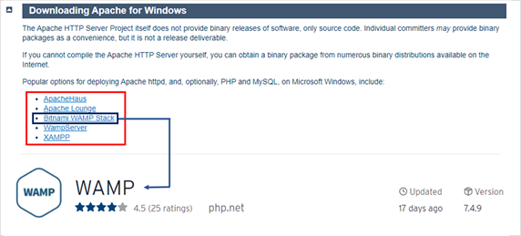
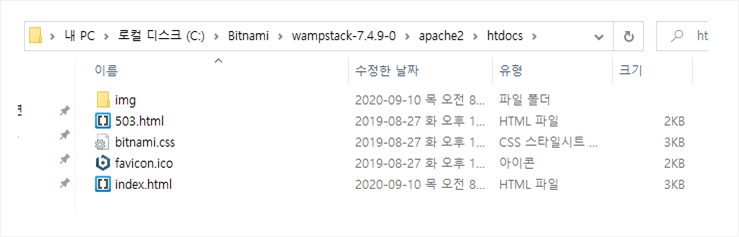

## 웹 서버

* 클라이언트와 대칭되는 개념으로, 클라이언트의 요청(Resquest)에 따라 적절한 결과를 응답(Response)하는 역할을 함.
* 대표적으로 Apache, NGINX, IIS 등이 있음.
* 호스트 ( host ) : 네트워크 호스트. 네트워크에 연결된 컴퓨터나 전자기기를 말한다. 인터넷은 TCP/IP 프로토콜을 이용하여 통신하므로, 일반적으로 호스트란 고유한 IP주소를 갖고 있어 통신이 가능한 컴퓨터를 말한다. 
* 호스팅 서비스 ( Hosting Service ) : 인터넷 접속 서비스 제공자가 제공하는 서버 보관 서비스. 즉 운용할 서버를 임대해주는 서비스.  

## Apache HTTP Server

* 아파치 소프트웨어 재단에서 만든 웹 서버 프로그램.
* 웹 창시자 팀 버너스 리의 `NCSA HTTPd` 기반으로 만들어짐.
* 일반적으로 리눅스 환경에서 많이 사용.
* 모듈 개념으로 확장성은 높으나, 무겁다.

## 웹 서버 구축하기 (Apache)

1. 준비하기
	
   [참조 : Apache User Support](https://httpd.apache.org/docs/2.4/en/platform/windows.html)
   
   > * `Apache HTTP Server`는 단순히 소스 코드만을 제공.
    > * 바이너리 릴리스의 경우는 각 운영체제의 컴퓨터가 읽을 수 있도록 미리 기계어로 컴파일됨 (사용자 컴퓨터 운영체제와 일치해야함) 
    > * 소스 릴리즈의 경우에는 컴파일되지 않은 원시적 코드이므로, 사용자가 직접 컴파일 과정을 진행해야함.
    > * 따라서 별도의 바이너리 패키지를 이용하여 Apache Server를 설치하면 편리함.  

2. 바이너리 패키지 설치

    : Bitnami WAMP Stack : **W**indows + **A**pache + **M**ySQL(DBMS) + **P**HP(Middle Ware) 통합 설치.
		

3. 방화벽 관련 사항은 Acess 허용.

4. 설치 종료 및 실행.

    : Bitnami WAMP Stack Manager Tool.
    
	
	
5. 정상 구동 확인.

	
	
	

## 서비스 하기

1. `Bitnami` 설치 폴더의 `apache2 / htdocs`가 기본 웹 페이지 위치. (htdocs = **H**yper**T**ext **Doc**ument**s**) 
		

2. 해당 위치의 html 파일을 적절하게 추가 및 수정하면 웹 페이지를 서비스할 수 있음.

## 기타 참고

* **읽어두면 좋은 내용** : **OSI 7계층**, **Internet Protocol Suite 4계층**

* `HTTP` (Hypertext Transfer Protocol) :
    * 웹에서 정보를 주고 받기 위해 사용되는 통신 규약(1996).
    * HTML 형식을 사용한 text 및 멀티미디어 자료 공유.
    * TCP 80번 포트를 사용한 응용계층. (Application Layer)
    * TCP 는 전송(Transport) 계층에서 작동하나, HTTP의 경우 응용(Application) 계층에서 작동함. (SMTP, IMAP과 동일)
    * Stateless 가 기본으로, 데이터를 주고 받기 위한 각 요청이 독립적임. 즉, 접속이 유지되지 않음.(대규모 접속 지원에 이점)

* `DNS (Domain Name System)` :  [참조 위치](https://github.com/16Hongc/TIL/blob/master/Xshell-AWS%20%EC%A0%91%EC%86%8D%20%EB%B0%A9%EB%B2%95(pem%20%EC%9D%B4%EC%9A%A9).md "사전 지식 항목")

* `IP Address (Internet Protocol Address)` : 
    * 각각의 장치를 나타내는 주소. 
    * 컴퓨터 마다 환경이 다르고 이 때문에 통신을 위해서는 공통된 통신 규약이 필요함.
    * 이를 위한 ISO위원회가 발족하였으나, 이해관계 대립으로 지연. (표준 자리를 빼앗김)
    * 현재는 TCP/IP가 사실상의 표준임. (IETF)

* `Localhost` / `127.0.0.1`(IPv4) / `::1`(IPv6) :  [참조 위치](https://github.com/16Hongc/TIL/blob/master/Xshell-AWS%20%EC%A0%91%EC%86%8D%20%EB%B0%A9%EB%B2%95(pem%20%EC%9D%B4%EC%9A%A9).md "사전 지식 항목")

* `Loopback` : 
    * 네트워크 유무에 관계없이 작동함.
    *  컴퓨터 자기 자신과 통신 할 수 있기 때문에 주로 테스트용으로 사용.

