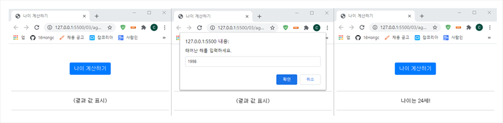
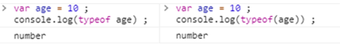
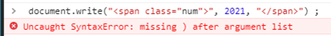
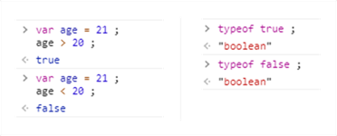

* 웹 브라우저에는 HTML분석기(HTML Parser) / CSS분석기(CSS Parser) / 자바스크립트해석기(Javascript Interpreter)가 포함되어 있음.

* 각각의 분석기 해석기는 사용자가 작성한 소스의 첫 번쨰 줄부터 차례로 내려가며 분석 및 해석함.
* <!DOCUTYPE html>은 HTML문서의 시작을 알리는 HTML 태그임. 브라우저는 이 태그를 읽고 해당 문서가 HTML문서임을 파악. 따라서 html 태그 사이의 내용을 HTML분석기로 HTML5표준에 맞추어 해석하기 시작.
* HTML분석기는 주로 HTML태그의 순서와 포함관계를 확인함. HTML분석기를 통해 브라우저는 head 태그 내에 구조와 요소를 파악하게 됨.
* CSS분석기는 HTML분석기의 태그 분석 후, style태그 사이의 스타일 정보를 분석함.
* 마지막으로 자바스크립트 해석기가 스타일 태그 사이의 자바스크립트 소스를 해석함.


---


규칙

1.대소문자를 구별하여 소스를 작성

2.읽기 쉽게 들여 쓰는 습관을 들인다

​	: 자바스크립트 해것기는 소슬르 처리할 떄 들여쓰기를 무시함. 가독성 및 관리를 위해서 들여쓰기를 습관화

3.세미콜론으로 문장을 구분

​	: 자바스크립트는 세미콜론 종결에 엄격하지 않으나, 줄바꿈 등의 경우 오류를 일으키기 때문에 정확히 하는 것이 중요

4. 메모는 주석을 활용

    * 한줄 주석 //
    * 복수 주석 /* */

5. 식별자는 정해진 규칙을 지켜 작성

    : 식별자는 자바스크립트 문법의 핵심 요소인 변수 함수 속성 등을 구별하기 위해 지명된 특정 단어를 의미. (식별자 명명 규칙 : 시작이 문자나 밑줄(_) 또는 달러기호로 시작해야 함.)

6. 예약어는 식별자로 사용할 수 없음

    : 예약어란 자바스크립트에 먼저 등록된 요소를 말함.

    (자바스크립트 예약어 정보 w3schools 문서 참고)


---

---

---


# 03. 변수와 자료형 그리고 연산자

## 목차

* 03-1 변수란 무엇인가

* 03-2 자료형 이해하기

---

## 03-1 변수란 무엇인가?


### 변수란?


변하는 수. 고정되지 않은 수.

프로그래밍에서의 변수란 수나 문자 등 데이터를 저장하기 위한 메모리 공간을 의미.

변수는 상수의 개념과 대비됨.

변수에 저장된 값은 변경될 수 있음.

변수를 사용하기 위해서는 반드시 미리 변수가 있다는 것을 컴퓨터에 알려주어야 하는데 이를 '변수를 선언한다'라고 함.


---


### 변수 선언 규칙


변수에는 컴퓨터가 구별할 수 있도록 이름을 붙여야 함.

선언할 변수 앞에 `var` 키워드를 붙이면 됨.

``` javascript
var age
```


ES6부터는 추가적인 예약어를 제공함.

`let` : var와 비슷하지만, 블록({ }) 내부에서만 사용할 수 있음.

`const` : 상수 선언 시 사용.


다만 변수를 선언에는 다음과 같은 규칙이 존재함.

>**변수 선언 규칙**
>
>1. <u>의미 있는 이름을 명명한다.</u>
>    * var aaa = 21 보다는 var age = 21이 더 좋음.
>2. <u>여러단어를 연결하여 변수를 명명할 때는 낙타혹 모양으로 만든다.</u>
>    * 첫 단어는 소문자로, 뒤의 단어는 대문자로 작성하는 것이 관례.
>3. <u>선언할 수 없는 변수 이름이 있다.</u>
>    * 변수의 이름은 반드시 문자 / 밑줄( _ ) / 달러( $ )로 시작해야 함.
>    * 또한 예약어 이름과 동일한 이름은 변수명으로 선언할 수 없음.


### 변수에 값 저장하기


변수에 값을 저장하기 위해서는 = (할당 연산자)를 사용함.

```javascript
var currentYear = 2021 ;
var age ;
age = currentYear - birthYear + 1 ; 
```


변수에 식을 저장하려는 경우, 사용될 변수를 미리 선언해야 함.

```javascript
var currentYear = 2021 ;
var birthYear = 2000 ;
var age ;
age = currentYear - birthYear + 1 ;
```


---


### 나이계산기


```javascript
<body>
    
    <script>
        function calc() {
            var currentYear = 2021 ;
            var birthYear = prompt("태어난 해를 입력하세요.", "YYYY") ;
            var age ;
            age = currentYear - birthYear + 1 ;
            document.querySelector("#result").innerHTML = "나이 : " + age + "세!"
        }
    </script>
</body>

// document.querySelector("#result").innerHTML
// : 문서(document)에서 선택자(querySelector)를 사용하여 id값이 result인 태그를 선택하고 HTML 내부(innerHTML)에 삽입한다는 의미.
```





## 03-2 자료형 이해하기

 

### 자료형의 종류

자료형(Data Type) : 컴퓨터가 처리하는 자료의 형태. 자바스크립트의 자료형은 값이 하나인 기본형과 여러 값을 갖고 있는 복합형으로 구별됨.


|  분류  |  자료형   | 설명                                               |
| :----: | :-------: | :------------------------------------------------- |
| 기본형 |  number   | 숫자.                                              |
| 기본형 |  string   | 문자열. 작은따옴표(')나 큰따옴표(")로 묶어 표현    |
| 기본형 |  boolean  | 논리형. 참(true) / 거짓(false) 두 가지 값으로 표현 |
| 기본형 | undefined | 미정의형. 자료형 지정 없을 때의 유형.              |
| 기본형 |   null    | 값이 유효하지 않을 때                              |
| 복합형 |   array   | 배열. 하나의 변수에 여러 값을 저장하는 유형.       |
| 복합형 |  object   | 객체. 함수와 속성이 함께 포함된 유형.              |


><u>**자료형 확인 방법**</u> : **typeof 연산자**
>
>* `typeof`는 변수의 데이터 타입을 반환하는 연산자임.
>* 사용방법 : typeof 변수명 / typeof(변수명)
>
>
>
>


#### 1. 숫자형(number) : 정수


자바스크립트에서의 숫자는 정수와 실수로 구분함. 

정수란 소수점 없는 숫자를 말함.

표현법에 따라  2진수, 8진수, 10진수, 16진수 등으로 나누기도 함. 


#### 2. 숫자형(number) : 실수


실수는 소수점이 있는 숫자르 말함. 

typeof 연산자로 확인 시, 정수와 마찬가지로 "number"로 타입이 확인됨.


#### 3. 문자형(string)


문자형(string)은 작은따옴표(', ')나 큰따옴표(", ")로 묶은 자료를 의미.

작은따옴표로 시작한 문자형 자료는 작은따욤표로, 큰따옴표는 시작한 문자형 자료는 큰따욤표로 종결되어야함.

따옴표를 이중으로 사용할 시, 따옴표가 중복되지 않도록 안과 밖을 각각 다른 따욤표를 사용하여야 함.




#### 4. 논리형(boolean) 


논리형은 참과 거깃이라는 값을 표시하는 자료형임.

프로그램에서 조건을 확인할 경우 많이 사용

`true`와 `false`는 모두 소문자로 표현

 




#### 5. undefined와 null

undefined는 자료형이 정의되지 않았을 때의 상태

자바스크립트에서는 변수를 선언할 때 미리 자료형을 지정하지 않고 값을 할당할 때 결정.

undefined는 결국 처음에 변수값이 할당되지 않았음을 의미함.


null은 처음 할당된 값이 더이상 유효하지 않다는 의미.

컴퓨터는 처음부터 값이 없던 변수와 값이 무효된 변수를 구분함.

따라서 보통 변수를 초기화하기 위하여 null을 사용.


#### 6. 배열(array)

배열이란 하나의 변수에 여러 값을 저장하는 변수형.

배열에 저장할 자료를 쉼표로 구분하여 대괄호로 묶은 방식으로 사용

대괄호 안에 데이터를 입력하지 않을 경우, 빈 배열로 생성됨.

배열 내부의 데이터는 차례로 인덱스 번호를 가지며, 이를 통하여 특정 값을 가져올 수 있음. (0부터 시작)


#### 7. 객체(object)

객체는 여러 자료를 중괄호로 묶을 수 있음.

배열과 비슷하지만, 각 요소들은 키(key) : 값(value)의 구조로 짝지어짐.


### 자바스크립트 자료형의 특징


* 강력한 자료형 체크(Strong Data Type Check)


* 느슨한 자료형 체크(Wake Data  )

