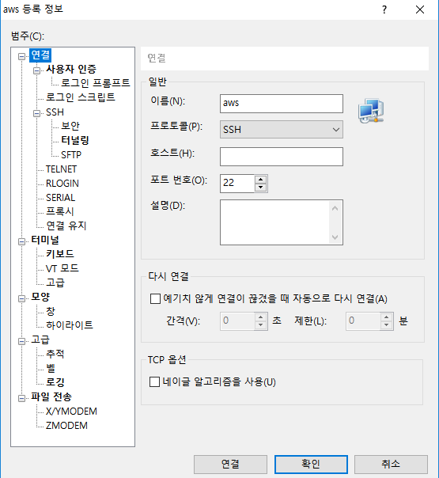

## I. 사전 지식

* SSH (Secure Shell Protocol)

  - Public Network(인터넷 등)를 통하여 컴퓨터 간 서로 통신을 할 때, 안전하게(보안) 통신을 하기 위해 사용하는 네트워크 프로토콜

  - 통신하기 위한 두 컴퓨터를 각 SSH-Client(내 컴퓨터), SSH-Server(원격)라 한다.

  -  이 두 컴퓨터는 'shell'을 통하여 접근 및 제어 가능하다

    

* PuTTY / Xshell

  윈도우는 기본적으로 SSH Client 기능을 제공하지 않는다. PuTTY , Xshell 두 프로그램은 이 기능을 대행한다.

  

* PEM (Privacy Enhanced Mail)

  여기서는 SSH에 접속하기 위한 키. ASCII 텍스트를 Base64로 인코딩한 것이다. 본래 Secure  Mail용으로 사용하였으나, 현재는 키나 인증서 등으로 사용되는 경우가 많다. 

  

* PPK (PuTTY Private Key)

  PEM 키를 PuTTY용으로 변환한 것
  
  
  
* Localhost / 127.0.0.1(IPv4) / ::1(IPv6)

  * 컴퓨터 스스로를 의미하는 가상 IP.  
  
    
* loopback(신호 또는 데이터가 지나온 경로로 되돌아가는 것) 호스트명

  * 네트워크가 연결 유무에 상관없이 작동한다. (내부 소프트웨어 처리)
  * 자기 자신과 통신할 수 있기 때문에 주로 테스트용으로 사용된다.

  

  

## II. xshell 설정

1. PEM 준비

   

   

2. xshell 다운 및 설치 ( https://www.netsarang.com/ko/ )

   

3. 세션창에서 '새로 만들기' 선택

   

   

4. '연결' 항목 

   * 이름 : 아무거나
   * 프로토콜 : SSH

   * 호스트 : 지정 받은 AWS IP or 당해 AWS 인스턴스의 '퍼블릭 DNS(ec2 ~)' )
   * 포트번호 : 22  (기본 설정) 

 

5. '사용자 인증' 항목

   * 방법 : Public Key 지정

   * 사용자 키 : 가져오기 -> PEM 파일 선택

     

6. '터널링' 항목

   * TCP/IP 추가
     * 종류 : Local
     * 원본 호스트 : 127.0.0.1
     * 수신 대기 포트 : 지정 받은 포트
     * 대상 호스트 : 127.0.0.1
     * 대상 포트 : 지정 받은 포트
   * x11 포워딩 체크 해제

   

## III. AWS 시작

 1. AWS 계정 로그인 ( https://console.aws.amazon.com/console/home )

    

 2. 계정ID, 사용자이름 및 암호 입력

    

 3. EC2 선택

    

 4. 인스턴스(좌측 패널) 항목 인스턴스 접속

    

 5. 중앙 테이블에서 해당하는 서버 우클릭 후 시작

## IV. 주피터 노트북 

1. Xshell 실행 및 연결

   

2. jupyter notebook 실행

   * jupyter notebook --ip=0.0.0.0 --port=포트번호 
   
   * --no-browser 추가 시, 따로 창이 뜨지 않음
   
     
   
3. token 확인 및 복사 ( 우클릭 후 복사 )

   

4. 127.0.0.1:지정 받은 포트번호 입력

   

5. token란에 복사한 token 입력 

   

6. jupyter notebook 실행 확인

